# 分布式多代理协作架构设计

> **版本**：v3.1  
> **日期**：2026-05-01  
> **定位**：企业级 AI 代理平台的业务架构规范。顶层是业务域与原子域，agent 是执行单元。以**专家化、权限归口、高稳定执行性、业务域驱动**四大骨架贯穿

---

## 目录

1. [设计目标](#1-设计目标)
2. [业务抽象层](#2-业务抽象层)
3. [代理分类体系](#3-代理分类体系)
4. [六种代理角色](#4-六种代理角色)
5. [四种服务形态](#5-四种服务形态)
6. [权限控制体系](#6-权限控制体系)
7. [系统架构图](#7-系统架构图)
8. [通信层设计](#8-通信层设计)
9. [协作模式](#9-协作模式)
10. [安全模型](#10-安全模型)
11. [代理生命周期管理](#11-代理生命周期管理)
12. [典型应用场景](#12-典型应用场景)
13. [与现有架构的差距与演进路径](#13-与现有架构的差距与演进路径)
14. [附录A：消息协议定义](#14-附录a消息协议定义)
15. [附录B：权限策略配置参考](#15-附录b权限策略配置参考)

---

## 1. 设计目标

### 1.1 四大核心骨架

| 骨架 | 含义 | 为什么 |
|------|------|--------|
| **业务域驱动** | 顶层是业务域，agent 是域内执行单元。原子域是稳定的、不可再分的业务能力单元，领域组合是动态的、可进化的 | AI 能力上升→组织扁平化→业务域边界溶解→需要稳定的原子域作为组合基底→领域动态组合与进化成为常态 |
| **专家化** | 一个 agent 集中服务多用户/多领域，见多识广，跨领域知识积累，越用越强 | 分散有多种维度：每人一个agent只见过该用户的问题，每领域一个agent只见过该领域的问题；集中则见过所有用户+所有领域的问题，才能发现跨用户、跨领域的关联 |
| **权限归口** | 所有外网请求→侦察代理唯一出口，所有内部数据→数据代理唯一访问归口，所有权限判定→主代理唯一决策点 | 分散=10个agent各自管权限=极易出现不一致；归口=权限逻辑只实现一次=一致性保证=审计集中 |
| **高稳定执行性** | 日常事务→固化技能处理（不依赖大模型推理，毫秒级），专家推理→大模型处理，两者共享记忆协同工作 | 固化技能保证日常事务的高稳定执行（无推理不确定性）；多进程架构实现故障隔离（任一代理异常不影响其他） |

### 1.2 业务域驱动：为什么这是顶层骨架

传统企业架构以"部门"和"系统"为边界。AI 的能力上升正在打破这些边界：

```
AI能力上升
  → 人需要的中间管理层减少
    → 组织扁平化
      → 原来靠部门边界隔离的业务域开始融合
        → 固定的"投研部""法务部"边界溶解
          → 需要更底层的划分：原子域
            → 原子域是稳定的、不可再分的业务能力单元
              → 如"风险评估""数据采集""合规检查""文档生成"
              → 原子域比业务域更稳定——业务域会融合，原子域不会
            → 领域组合变得动态：
              → 投研+合规=合规投研（今天组合，明天可能拆开重组）
              → 供应链+风控=供应链风控（按需组合，用完解散）
            → 组合的进化性：
              → 随着AI能力继续上升，原子域本身也在演化
              → 今天"风险评估"是一个原子域，明天可能拆为"市场风险""信用风险""操作风险"
              → 进化方向不确定，但架构必须为此留有空间
```

**关键洞察**：原子域之所以重要，是因为**上层组合在变，底层原子要稳**。如果底层是"投研域"这种大颗粒度，组合时只能整块搬，无法精细编排。原子域是乐高积木，领域组合是搭出来的形状——形状可以随时拆了重搭。

**当前状态**：原子域的划分标准、动态组合的触发机制、进化的驱动模型——这些还没有落地点。但**思想必须在架构中占位**，否则将来演进时没有锚点。本文将原子域作为架构的顶层概念之一，具体落地细节留待演进路径的后期阶段。

### 1.3 衍生原则

| 原则 | 含义 | 来源骨架 |
|------|------|---------|
| **业务域边界** | 每个业务域有明确的数据边界、权限边界、专家边界。跨域协作通过编排层，不通过域间直连 | 业务域驱动 |
| **能力可复用** | 原子域沉淀的能力可跨业务域复用——投研域的"风险评估"能力可复用到供应链域 | 业务域驱动 |
| **网络分区感知** | 代理部署位置决定其网络可达性和信任等级，架构天然适配企业安全边界 | 权限归口 |
| **永久与临时分离** | 知识资产（永久代理）持续进化成为专家；执行资源（临时代理）按需调度、用完释放 | 专家化 |
| **推拉结合** | 永久代理可主动推送信号（监控型）；临时代理被动响应指令（执行型） | 永久与临时分离 |
| **决策归口** | 主代理是唯一的决策出口，子代理只提供输入和建议 | 权限归口 |
| **全链路可审计** | 代理间所有通信和操作写入不可篡改的审计日志 | 权限归口 |
| **权限即架构** | 权限不是附加功能，是每一层（业务域、专家化、归口、协作、数据）的横切骨架 | 权限归口 |
| **双轨执行** | 固化技能（确定性）与专家推理（概率性）并行，共享记忆，故障隔离 | 高稳定执行性 |

### 1.4 设计约束

- 业务域是顶层概念，agent 是域内执行单元，不脱离域独立存在
- 跨域协作必须通过编排层，不通过域间 agent 直连
- 主代理不可直接访问外网
- 内部数据不向 DMZ 方向流出原始数据（数据代理返回结果给核心区，经脱敏后才可跨区传输）
- 外部数据必经清洗和可信度标注
- 跨区通信必须经过认证和加密
- 临时代理无持久化、无记忆、无网络直连
- 权限变更热加载，不中断服务
- 日常事务优先走固化技能，不占用大模型推理资源

---

## 2. 业务抽象层

> 这是本文新增的核心章节。之前的版本从 agent 开始，缺少业务层抽象。企业级架构的顶层不是 agent，是业务域。

### 2.1 六层抽象架构

```
┌─────────────────────────────────────────────────────────────┐
│  L6 业务域层                                                  │
│  投研域 · 法务域 · 供应链域 · 运营域 · 研发域 · ...           │
│  域有边界：数据、权限、专家、流程                               │
└──────────────────────┬──────────────────────────────────────┘
                       │ 域由原子域组合而成
┌──────────────────────┴──────────────────────────────────────┐
│  L5 原子域层（稳定的业务能力单元）                              │
│  风险评估 · 数据采集 · 合规检查 · 文档生成 · 审批流转 · ...    │
│  原子域不可再分，可跨业务域复用                                  │
│  原子域是稳定的——业务域会融合，原子域不会                        │
│  ※ 原子域的划分标准、动态组合机制、进化模型——当前为思想占位       │
└──────────────────────┬──────────────────────────────────────┘
                       │ 原子域由能力实例化
┌──────────────────────┴──────────────────────────────────────┐
│  L4 能力层（可复用的业务能力）                                  │
│  分析能力 · 监控能力 · 审批能力 · 生成能力 · 查询能力 · ...     │
│  能力跨域复用：投研域的"风险评估能力"→供应链域的"供应商评估"    │
│  能力有版本：v1(规则) → v2(模型) → v3(多专家会诊)              │
└──────────────────────┬──────────────────────────────────────┘
                       │ 能力由流程编排
┌──────────────────────┴──────────────────────────────────────┐
│  L3 流程编排层（跨角色、跨步骤、跨系统的业务流程）               │
│  审批流 · 采购流 · 入职流 · 投研流 · 侵权预警流 · ...          │
│  流程跨原子域：审批流 = 合规检查 + 风险评估 + 审批流转          │
│  流程跨系统：采购流 = ERP(采购单) + OA(审批) + 财务(付款)      │
└──────────────────────┬──────────────────────────────────────┘
                       │ 流程由 agent 集群执行
┌──────────────────────┴──────────────────────────────────────┐
│  L2 代理层（执行单元）                                         │
│  主代理 · 侦察代理 · 数据代理 · 专家代理 · 执行代理 · 验证代理 │
│  agent 绑定在业务域内，不脱离域独立存在                         │
│  agent 间协作通过消息总线和编排引擎                             │
└──────────────────────┬──────────────────────────────────────┘
                       │ agent 通过系统对接层访问外部
┌──────────────────────┴──────────────────────────────────────┐
│  L1 系统对接层（企业已有系统的适配与编排）                       │
│  OA · ERP · CRM · BI · 知识库 · 邮件 · 文档系统 · ...        │
│  每个系统有适配器：数据代理通过适配器读写，agent 不直连系统       │
│  适配器统一认证、脱敏、审计                                     │
└─────────────────────────────────────────────────────────────┘
```

### 2.2 各层详解

#### L6 业务域层

业务域是企业业务的一级划分。每个域有：

| 维度 | 说明 | 示例（投研域） |
|------|------|--------------|
| **数据边界** | 该域可见的数据范围 | 持仓数据、研报、市场行情 |
| **权限边界** | 该域内谁可以做什么 | 研究员可查询，投资经理可审批 |
| **专家边界** | 该域的专家知识范围 | 财经分析师、估值建模 |
| **流程边界** | 该域的核心业务流程 | 投研→评审→决策→执行 |
| **系统边界** | 该域对接的外部系统 | Bloomberg、Wind、内部交易系统 |

**业务域的动态性**：随着 AI 能力上升和组织扁平化，业务域的边界会溶解和重组。今天的"投研域+法务域"明天可能融合为"合规投研域"。架构必须支持这种动态性——这就是原子域存在的意义。

#### L5 原子域层

原子域是稳定的、不可再分的业务能力单元。

| 特性 | 说明 |
|------|------|
| **稳定性** | 业务域会融合，原子域不会——"风险评估"不管在投研域还是供应链域，其本质不变 |
| **可复用性** | 同一个原子域可以被多个业务域使用——"合规检查"在投研域查交易合规，在法务域查合同合规 |
| **可组合性** | 业务域 = 原子域的组合——"投研域" = 数据采集 + 风险评估 + 合规检查 + 文档生成 |
| **可进化性** | 原子域本身也在演化——"风险评估"可能从规则引擎→模型评估→多专家会诊 |

**原子域划分原则（当前认知，待演进）**：

| 原则 | 说明 | 示例 |
|------|------|------|
| 不可再分 | 拆分后失去业务意义 | "风险评估"拆为"风险"+"评估"无意义 |
| 跨域复用 | 至少被2个以上业务域使用 | "合规检查"被投研、法务、供应链共用 |
| 独立演进 | 能力升级不影响其他原子域 | "数据采集"从RSS→API→浏览器自动化，不影响"风险评估" |

**原子域与领域组合的动态性（思想占位）**：

```
当前认知：
  业务域 = 原子域的静态组合
  投研域 = [数据采集, 风险评估, 合规检查, 文档生成]

未来方向：
  业务域 = 原子域的动态组合
  - 触发机制：当投研域和法务域的协作频率超过阈值 → 自动建议融合
  - 组合验证：新组合是否提升了效率？是否引入了新风险？
  - 进化驱动：AI能力提升 → 某个原子域可以自动化更多 → 组合方式改变

未落地的核心问题：
  1. 原子域的划分标准是什么？—— 业务语义？技术边界？组织边界？
  2. 动态组合的触发机制是什么？—— 人工决策？AI建议？自动触发？
  3. 进化的度量标准是什么？—— 效率？准确率？成本？
  4. 组合失败时如何回退？—— 拆分？降级？人工介入？
```

#### L4 能力层

能力是原子域的具体实例化，可版本化、可复用。

| 能力 | 所属原子域 | 版本 | 复用域 |
|------|----------|------|--------|
| 估值建模 | 风险评估 | v1(规则) → v2(模型) → v3(多专家会诊) | 投研域 |
| 供应商评级 | 风险评估 | v1(评分卡) → v2(模型) | 供应链域 |
| 专利相似度 | 风险评估 | v1(关键词) → v2(语义) → v3(多维度) | 法务域 |
| 市场数据采集 | 数据采集 | v1(RSS) → v2(API) → v3(浏览器自动化) | 投研域、供应链域 |
| 合规政策检查 | 合规检查 | v1(规则库) → v2(模型) | 投研域、法务域、供应链域 |

**能力复用机制**：

```
投研域需要"风险评估" → 调用风险评估原子域 → 实例化为"估值建模"能力
供应链域需要"风险评估" → 调用同一个原子域 → 实例化为"供应商评级"能力

同一个原子域，不同业务域，不同实例化，共享底层知识但各自演进。
→ 投研域的估值建模经验可以反哺原子域 → 供应链域的供应商评级自动受益
```

#### L3 流程编排层

业务流程跨原子域、跨角色、跨系统。流程编排层负责：

| 职责 | 说明 | 示例 |
|------|------|------|
| **步骤编排** | 定义流程的步骤、顺序、条件分支 | 审批流：申请→合规检查→风险评估→审批→执行 |
| **角色路由** | 每个步骤由谁执行（人/agent/系统） | 合规检查→合规官agent，审批→部门经理（人） |
| **系统对接** | 流程中需要读写哪些外部系统 | 采购流：ERP(采购单)→OA(审批)→财务(付款) |
| **状态管理** | 流程实例的状态持久化和恢复 | 审批进行中→暂停→恢复→完成 |
| **异常处理** | 超时、拒绝、系统不可用时的降级策略 | ERP不可用→记录意图→恢复后重试 |

#### L2 代理层

agent 是业务域内的执行单元。

| 特性 | 说明 |
|------|------|
| **域绑定** | agent 不脱离业务域独立存在——投研域的财经专家不会处理法务域的合同审查 |
| **跨域协作** | 跨域请求通过编排层，不通过 agent 间直连 |
| **能力调用** | agent 调用原子域的能力，能力由 agent 实例化 |
| **知识归属** | agent 积累的知识属于其所在业务域，跨域共享通过能力层 |

#### L1 系统对接层

企业已有系统（OA/ERP/CRM/BI等）的适配与编排。

| 组件 | 职责 | 示例 |
|------|------|------|
| **适配器** | 统一接口封装，屏蔽系统差异 | ERP适配器：SAP/Oracle/用友 → 统一的采购查询接口 |
| **认证桥接** | 统一认证，agent 不持有各系统凭证 | 数据代理通过适配器认证访问ERP，agent 无ERP凭证 |
| **脱敏** | 系统返回数据按业务域需求脱敏 | ERP返回供应商列表 → 供应链域看完整版，投研域看脱敏版 |
| **审计** | 所有系统访问可追溯 | 谁在什么时候通过哪个适配器查了什么数据 |

### 2.3 层间关系与数据流

```
业务域请求
  ↓ 编排层分解为原子域调用
  ↓ 原子域实例化能力
  ↓ 能力由 agent 执行
  ↓ agent 通过系统对接层访问外部系统
  ↓ 结果沿原路返回，每层添加自己的上下文

数据流：
  业务域(投研域) → 编排层(投研流) → 原子域(风险评估) → 能力(估值建模)
    → agent(财经专家) → 系统对接层(Wind适配器) → Wind数据库
    ← Wind数据 ← 适配器(脱敏) ← agent(分析) ← 原子域(沉淀) ← 编排层(整合)
    ← 业务域(投研报告)
```

---

## 3. 代理分类体系

### 3.1 按生命周期

| 维度 | 永久代理 | 临时代理 |
|------|---------|---------|
| 本质 | 业务域的知识资产，持续进化成为域内专家 | 项目的执行资源，用完释放 |
| 类比 | 全职员工 | 外包/顾问 |
| 绑定 | 绑定在业务域内，服务域内所有用户和流程 | 按需调度，无域绑定 |
| 知识 | 持续积累，跨领域关联，越用越强 | 无跨任务记忆 |
| 部署 | 常驻进程，跨网络分区 | 按需调度，无网络直连 |
| 通讯 | 可主动推送（告警/信号） | 仅被动响应（任务→结果） |
| 故障 | 健康检查+自动恢复 | 超时终止+主代理决定重试 |
| 典型 | 主代理、侦察代理、数据代理、专家代理 | 执行代理、验证代理 |

**永久代理的专家化定位**：永久代理之所以"永久"，不是为了节省启动开销，是因为**知识积累需要时间**。一个侦察代理监控了1000个信号源，它才知道什么是"异常"；一个财经专家分析了500份研报，它才能发现跨行业关联。临时代理用完就销毁，没有跨任务积累，无法成为专家——这是设计使然，不是缺陷。

### 3.2 按网络分区

| 分区 | 信任等级 | 代理 | 网络可达 |
|------|---------|------|---------|
| 核心区 | L0-L2 | 主代理(L0)、数据代理(L1)、专家代理(L2) | 内网全通，外网不通 |
| DMZ | L3 | 侦察代理(L3)，无论永久/临时模式均共享DMZ部署和出站策略 | 仅出站HTTPS，不知内网结构 |
| 无网络 | L4 | 执行代理、验证代理 | 无直连网络，仅处理注入的上下文 |

### 3.3 按能力模式

| 模式 | 特征 | 适用场景 | 响应时间 | 可靠性 |
|------|------|---------|---------|--------|
| **固化技能** | 确定性执行，不依赖大模型推理 | 定时提醒、日程同步、账单跟踪、格式转换、L1自动审批 | 毫秒级 | 极高（无推理不确定性） |
| **专家推理** | 概率性推理，依赖大模型 | 投研分析、架构评审、合同审查、L3深度审批 | 秒级 | 依赖模型质量 |

**双轨协同**：固化技能和专家推理共享记忆（MEMORY.md/知识库），固化技能处理不了的请求自动升级到专家推理，专家推理的结论可以固化为新技能。

```
用户请求 → 固化技能匹配？
  ├─ 是 → 固化技能执行（毫秒级，高稳定）
  └─ 否 → 专家Agent推理（秒级，高智能）
       ↓ 结论验证通过
       → 固化为新技能（下次毫秒级处理）
```

---

## 4. 六种代理角色

> agent 是业务域内的执行单元，不是顶层概念。以下角色描述都在业务域的上下文中。

### 4.1 🧠 主代理（Brain）— 永久 · 核心区 · 域绑定

**职责**：域内意图理解、任务编排、决策、跨代理协调、权限执行

**核心能力**：
- 接收业务域内的用户请求，匹配十大主题分类，确定认知推理范式
- 拆解任务为子任务，选择合适的代理和协作模式
- 整合子代理结果，做出最终决策
- **执行权限策略**：根据用户角色和群配置，决定允许/拒绝操作
- **权限归口的决策点**：所有权限判定（允许/拒绝访问）由此发出，子代理不自行决定
- **注意**：权限判定≠专业判断。权限判定（允许/拒绝访问）归口主代理；专业判断（合规/风险/估值）由专家提供，主代理综合决策
- **域边界守护**：拒绝跨域直连请求，跨域协作必须通过编排层

**硬约束**：
- 不直接访问外网
- 不直接操作数据库
- 不直接连接其他业务域的 agent
- 所有决策必须可追溯（记录推理链）
- 权限检查先于任务执行

### 4.2 🔭 侦察代理（Scout）— 永久/临时 · DMZ · 全域共享

**职责**：外部信息采集、情报收集、环境感知

**两种运行模式**：

| 模式 | 触发 | 行为 | 类比 |
|------|------|------|------|
| 永久模式 | 系统启动 | 持续监控 RSS/API/网站，发现信号主动上报 | 哨兵 |
| 临时模式 | 主代理指令 | 执行特定搜索任务，返回结果后待命 | 斥候 |

**核心能力**：
- 多源信息采集（网页、API、RSS、社交媒体）
- 采集内容自动标注：来源、时间、可信度、相关性
- 信号检测：异常波动、新出现的关键词、模式变化
- 主动推送：发现高价值信号时通过告警通道立即上报

**硬约束**：
- **唯一外网出口**：所有外网请求必须经此代理，这是权限归口的基础
- 不知内网结构
- 不存储内部数据
- 所有采集结果必须带可信度评分
- 单次采集结果大小受限（防数据外泄通道）

### 4.3 🏛️ 数据代理（Vault）— 永久 · 核心区 · 域绑定+系统对接

**职责**：内部数据访问、知识库管理、数据治理、系统对接

**核心能力**：
- 读取内部数据库、知识库、文档系统、代码仓库
- **系统对接**：通过适配器访问企业已有系统（OA/ERP/CRM/BI），agent 不直连系统
- 数据脱敏：根据请求方身份和权限等级决定返回完整数据还是脱敏版本
- 数据质量守门：脏数据不入库，可疑数据标注风险
- 访问审计：记录谁查了什么、什么时候查的、通过哪个适配器

**硬约束**：
- **唯一内部数据访问归口**：所有内部数据访问必须经此代理，这是权限归口的基础
- 不修改数据源（只读，写入需主代理审批）
- 不向 DMZ 方向推送原始数据
- 查询结果必须脱敏后才能发送给核心区以外的代理
- 数据访问遵循最小权限原则
- 系统凭证仅数据代理持有，agent 不持有各系统凭证

### 4.4 👨‍🔬 专家代理（Expert）— 永久 · 核心区 · 域绑定

**职责**：领域深度分析、专业判断、知识演进

**专家类型**：

| 专家 | 业务域 | 原子域 | 核心技能 | 典型输出 |
|------|--------|--------|---------|---------|
| 财经分析师 | 投研域 | 风险评估 | 估值建模、研报解读、风险预警 | 投资建议、风险报告 |
| 专利分析师 | 法务域 | 风险评估 | 检索、相似度、侵权检测、价值评估 | 侵权预警、专利地图 |
| 技术架构师 | 研发域 | 架构评审 | 技术选型、代码审查、性能诊断 | 架构评审、优化方案 |
| 合规官 | 法务域 | 合规检查 | 政策解读、合规检查、风险评估 | 合规报告、整改建议 |

**注意**：同一原子域（如"风险评估"）在不同业务域有不同的专家实例化——投研域是"财经分析师"，法务域是"专利分析师"，供应链域是"供应商评级师"。底层能力共享，表层专业化。

**自我改进机制**：
- 分析准确率追踪 → 策略调整
- 用户反馈（采纳/拒绝）→ 知识库更新
- 跨领域关联发现 → 扩展知识边界
- 定期知识库审查 → 淘汰过时知识
- **能力反哺**：域内经验沉淀到原子域能力层 → 其他域的同类专家自动受益

**硬约束**：
- 不直接访问数据源（通过数据代理获取）—— 权限归口
- 不直接访问外网（通过侦察代理获取）—— 权限归口
- 不直接连接其他业务域的 agent —— 域边界
- 专业判断必须附带置信度和证据链

### 4.5 ⚙️ 执行代理（Worker）— 临时 · 按需调度

**职责**：具体编码、文档生成、数据处理等执行任务

**硬约束**：
- 无记忆：不持有跨任务状态
- 无持久化：不写入任何永久存储
- 无网络：不直接联网
- 受限时：必须在规定时间内完成
- 权限受限：只能访问本次任务上下文中声明的资源

### 4.6 ✅ 验证代理（Auditor）— 临时 · 按需调度

**职责**：交叉验证、质量审计、合规检查

**验证维度**：

| 维度 | 检查内容 |
|------|---------|
| 事实准确性 | 数据是否与来源一致，计算是否正确 |
| 逻辑一致性 | 推理链是否完整，结论是否从前提得出 |
| 合规性 | 是否违反安全策略、数据保护规则 |
| 完整性 | 是否有遗漏、是否覆盖所有要求 |
| 权限合规 | 操作是否在权限范围内 |

**硬约束**：
- 独立于执行链，由主代理直接调度
- 审计日志不可篡改
- 验证失败必须给出具体原因和修复建议

---

## 5. 四种服务形态

### 5.1 形态一：单代理专家化服务（1:N）

**一个 agent 集中服务业务域内多个用户/群——本质是专家化，不是共享。**

```
        用户A (投研)    ──┐
        用户B (法务)    ──┤     ┌────────────────────────────┐
        用户C (技术)    ──┤────►│   专家 Agent                │
        群X (AI日报)   ──┤     │                             │
        群Y (财经群)   ──┘     │   处理A的问题 → 积累投研知识  │
                                 │   处理B的问题 → 积累法务知识  │
                                 │   处理C的问题 → 积累技术知识  │
                                 │                             │
                                 │   跨领域关联：投研+法务=合规投研│
                                 │   越用越强，见多才能识广       │
                                 │                             │
                                 │   + 权限隔离层               │
                                 │   + 群技能绑定               │
                                 └────────────────────────────┘
```

**为什么集中，而不是分散？**

分散有多种维度，每种都不如集中：

| 分散维度 | 每个agent看到什么 | 看不到什么 | 结果 |
|---------|-----------------|-----------|------|
| 每人一个agent | 只见过该用户的问题 | 其他用户的问题、跨用户关联 | 10个用户=10个互不相识的浅薄agent |
| 每领域一个agent | 只见过该领域的问题 | 其他领域的问题、跨领域关联 | 投研agent不知道法务agent的合同风险 |
| 集中（1:N专家agent） | 所有用户+所有领域的问题 | — | 见多识广，越用越强 |

**核心本质：见多识广**

```
用户A问：XX行业趋势如何？
  → 专家agent处理 → 积累行业知识

用户B问：XX合同条款有无法律风险？
  → 专家agent处理 → 积累法务知识
  → 同时发现：A的行业趋势中提到的政策变化，正是B的合同条款风险的根因
  → 跨领域洞察：主动告知A和B，"你们的问题其实是同一个"

每人一个agent → A的agent不知道B的问题，B的agent不知道A的行业
每领域一个agent → 投研agent不知道法务的合同风险，法务agent不知道行业的政策变化
集中一个专家agent → 所有问题都经过它，配合知识管理机制，可以发现跨用户、跨领域的关联
```

**权限隔离：让同一个专家对不同人表现出不同边界**

| 层 | 机制 | 作用 |
|----|------|------|
| **命令隔离** | `restricted_channels` 命令过滤 | 受限群禁止执行命令、修改技能等有副作用操作 |
| **工具隔离** | `restricted_channels` 工具集过滤 | 受限群只允许只读工具（搜索、查询），禁止写操作 |
| **技能隔离** | `channel_skill_bindings` | 不同群绑定不同技能组合（AI群→AI技能，财经群→财经技能） |

**优势**：
- **专家化**：一个agent处理多领域问题，积累跨领域知识，越用越强
- **跨领域洞察**：分散agent做不到的关联发现
- **维护成本低**：一次维护所有用户受益

**局限**：
- 单点瓶颈：agent 是单进程，高并发时排队
- 权限设计必须严谨：共享专家，必须确保A的知识不泄漏给B
- 群记忆隔离需完善

### 5.2 形态二：多代理权限归口调度（N:1）

**多个 agent 按需调度，服务于同一个业务域——本质是权限归口，不是流量分发。**

```
        业务域请求 ────► 归口调度层 ─────┬──► Agent-A（快模型/固化技能）
                                        ├──► Agent-B（强模型/专家推理）
                                        └──► Agent-C（领域专家）
                                             用户只看到"一个"助手

        所有外网请求 ────► 只有侦察代理能出 ────► 一个出口，一个审计点
        所有内部数据 ────► 只有数据代理能读 ────► 一个访问归口，一个脱敏点
        所有权限判定 ────► 只有主代理能判   ────► 一个决策点，一个策略引擎
```

**核心本质：权限归口**

```
有归口层：
  所有数据请求 → 数据代理（唯一有数据访问权限的）→ 通过系统对接层访问 → 脱敏 → 返回
  所有外网请求 → 侦察代理（唯一有外网权限的）→ 标注可信度 → 返回
  所有权限判定 → 主代理（唯一有策略引擎的）→ 允许/拒绝 → 执行

  权限逻辑只写一次，审计只有一个来源，脱敏只有一个策略。
```

**优势**：
- **权限归口**：所有权限逻辑集中实现，一致性保证
- **审计集中**：一条链路完整可追溯
- **脱敏统一**：数据代理统一执行，不会出现某个agent忘了脱敏
- 弹性伸缩：高峰期扩容 Agent 池

**局限**：
- 归口层是单点——需要高可用设计
- 归口层性能是系统瓶颈

### 5.3 形态三：多对多协作（N:N）

**多个业务域之间或域内多个 agent 之间对等协作。**

```
    🧠 主代理(投研域) ←── 域间编排 ──→ 🧠 主代理(法务域)
       ↑↓                                  ↑↓
    🔭 侦察 ←──── 信号 ────→ 🏛️ 数据代理
       ↑↓                                  ↑↓
    ⚙️ 执行 ←──── 结果 ────→ ✅ 验证
```

**域内协作** vs **域间协作**：

| 维度 | 域内协作 | 域间协作 |
|------|---------|---------|
| 通信 | 消息总线直连 | 必须通过编排层 |
| 权限 | 域内权限体系 | 跨域权限需双方主代理批准 |
| 数据 | 域内数据可自由流动 | 跨域数据必须脱敏 |
| 审计 | 域内审计 | 跨域审计双记 |

### 5.4 形态四：混合形态

**实际部署往往是三种形态的组合。**

```
业务域(1:N专家化) → 归口调度层(N:1权限归口) → 代理集群(N:N协作)
        ↑                                         ↑
    域间编排层 ←──────── 域间协作 ────────────────┘
```

---

## 6. 权限控制体系

### 6.1 权限模型总览

权限是**五个正交维度**的组合（比v3.0增加了业务域维度）：

```
权限 = f(谁, 在哪, 做什么, 访问什么数据, 在哪个业务域)

谁       → 用户身份 (user_id) + 用户角色 (role) + 组织岗位
在哪     → 上下文 (群/频道/会话) + 网络区 (核心/DMZ/外部)
做什么   → 操作类型 (命令/工具/技能/通信/流程)
访问什么 → 数据范围 (公开/内部/机密/受限)
业务域   → 哪个业务域 + 原子域 + 跨域权限
```

### 6.2 业务域权限

| 规则 | 说明 | 示例 |
|------|------|------|
| **域边界隔离** | agent 不脱离域独立存在，跨域请求必须通过编排层 | 投研域的财经专家不能直接访问法务域的合同数据 |
| **跨域协作审批** | 跨域数据访问需双方主代理批准 | 投研域需要法务域的合规数据 → 法务主代理审批 → 脱敏后传递 |
| **原子域能力复用权限** | 同一原子域在不同域的实例化，共享底层但各自演进 | "风险评估"原子域→投研域实例化=估值建模，供应链域实例化=供应商评级 |
| **组织架构映射** | 用户角色与组织岗位关联 | 投资部研究员→投研域trusted，法务部律师→法务域trusted |

### 6.3 用户角色体系

#### 角色定义

| 角色 | 权限范围 | 典型用户 |
|------|---------|---------|
| `admin` | 全部权限：命令执行、技能管理、配置变更、数据写入、用户管理、跨域审批 | 管理员 |
| `trusted` | 大部分权限：问答、搜索、工具使用、数据读取；禁止配置变更和用户管理 | 高级用户 |
| `blacklist` | 禁止交互 | 被封禁用户 |

#### 角色能力矩阵

| 能力 | admin | trusted | blacklist |
|------|-------|---------|-----------|
| 问答/对话 | ✅ | ✅ | ❌ |
| 搜索/查询 | ✅ | ✅ | ❌ |
| 工具执行（只读） | ✅ | ✅ | ❌ |
| 工具执行（写入） | ✅ | ✅ (受限) | ❌ |
| 技能管理 | ✅ | ❌ | ❌ |
| 命令执行 | ✅ | ❌ | ❌ |
| 配置变更 | ✅ | ❌ | ❌ |
| 用户管理 | ✅ | ❌ | ❌ |
| 跨域审批 | ✅ | ❌ | ❌ |
| 数据写入 | ✅ | ✅ (受限) | ❌ |

### 6.4 群/频道级权限

#### 三道防线（已实现）

| 防线 | 位置 | 作用 | 实现 |
|------|------|------|------|
| **命令过滤** | `gateway/run.py` L4273 | 受限群禁止执行命令 | 检查 `restricted_channels` → 拦截 slash 命令 |
| **工具集过滤** | `gateway/run.py` L10574 | 受限群限制可用工具 | 动态修改 `enabled_toolsets` |
| **提示词过滤** | `gateway/session.py` L377 | 受限群注入权限提示 | 在系统提示中告知 agent 当前权限边界 |

#### 群权限配置

```yaml
gateway:
  restricted_channels:
    oc_6ed1cc645057da3bbe93c6120219a61e:  # AI日报群
      users:
        - id: ou_d366ba075912a3865430a7fe7020454b
          role: admin
      allowed_commands: []        # 空列表 = 禁止所有命令
      allowed_toolsets:           # 允许的工具集
        - web
        - file
      denied_tools:               # 明确禁止的工具
        - terminal
        - write_file
        - skill_manage
      blacklist: []
```

#### 群技能绑定

```yaml
feishu:
  channel_skill_bindings:
    - id: "oc_6ed1cc645057da3bbe93c6120219a61e"
      skills: ["group-thinking", "source-evolution", "core-thinking"]
    - id: "oc_finance_group_id"
      skills: ["financial-analysis", "source-evolution"]
```

### 6.5 代理间权限

#### 信任分级

| 等级 | 代理 | 能做 | 不能做 |
|------|------|------|--------|
| L0 完全信任 | 主代理 | 一切 | — |
| L1 高信任 | 数据代理 | 读取内部数据+系统对接 | 修改数据源、外传原始数据 |
| L2 中信任 | 专家代理 | 读取主代理下发的上下文 | 直接访问数据源、访问外网、跨域直连 |
| L3 低信任 | 侦察代理 | 访问外网、返回结果 | 知晓内网结构、存储内部数据 |
| L4 不信任 | 临时执行/验证代理 | 仅处理本次任务上下文 | 持久化、记忆、网络直连 |

#### 代理间通信权限矩阵

| 发送方 \ 接收方 | 主代理 | 数据代理 | 专家代理 | 侦察代理 | 临时代理 |
|----------------|--------|---------|---------|---------|---------|
| 主代理 | — | ✅ | ✅ | ✅ | ✅ |
| 数据代理 | ✅ | — | ❌ | ❌ | ❌ |
| 专家代理 | ✅ | ❌ | ⚠️ (需主代理中转) | ❌ | ❌ |
| 侦察代理 | ✅ | ❌ | ❌ | — | ❌ |
| 临时代理 | ✅ | ❌ | ❌ | ❌ | — |

**规则**：
- 所有子代理→主代理：✅ 允许（结果回传、告警上报）
- 子代理→子代理：❌ 默认禁止，需主代理中转
- 专家代理间通信：⚠️ 需主代理编排（会诊模式），不可直接通信
- **跨域 agent 通信**：❌ 默认禁止，必须通过编排层

#### 令牌授权

```json
{
  "token_id": "tk_20260501_001",
  "issuer": "brain",
  "subject": "scout-01",
  "task_id": "task_20260501_001",
  "business_domain": "investment_research",
  "permissions": {
    "channels": ["task.execute", "result.submit", "alert.signal"],
    "data_scope": "external_only",
    "tools": ["web_search", "web_extract", "browser_navigate"],
    "max_result_size_kb": 512,
    "expires_at": "2026-05-01T10:05:00Z"
  }
}
```

### 6.6 数据权限

#### 数据分级

| 级别 | 标签 | 可流向 | 脱敏要求 |
|------|------|--------|---------|
| Public | `public` | 所有区域 | 无 |
| Internal | `internal` | 仅核心区 | 跨区传输时需脱敏 |
| Confidential | `confidential` | 仅主代理+数据代理 | 必须脱敏后才可转发给专家 |
| Restricted | `restricted` | 仅主代理 | 不可转发 |
| PII | `pii` | 必须脱敏 | 脱敏后才可传输（任何区域） |

#### 脱敏规则

| 请求方 | 数据分级 | 返回策略 |
|--------|---------|---------|
| 主代理 | 任何 | 完整数据 |
| 数据代理 | internal+ | 完整数据（自身职责） |
| 专家代理 | internal | 脱敏后返回（去除 PII 和 restricted 字段） |
| 侦察代理 | public | 仅 public 数据 |
| 临时代理 | 按任务令牌 | 仅令牌声明的数据范围 |
| 跨域请求 | 按跨域权限 | 按目标域权限等级脱敏 |

### 6.7 权限变更热加载

| 变更类型 | 触发方式 | 生效时机 | 影响范围 |
|---------|---------|---------|---------|
| 用户角色变更 | 修改 config.yaml | 下次请求时 | 该用户的所有会话 |
| 群权限变更 | 修改 restricted_channels | 下次请求时 | 该群的所有会话 |
| 技能绑定变更 | 修改 channel_skill_bindings | 下次新会话 | 该群的新会话 |
| 代理信任等级变更 | 证书更新 | mTLS 重连时 | 该代理的所有连接 |
| 数据分级变更 | 策略引擎更新 | 下次查询时 | 所有后续查询 |
| 跨域权限变更 | 编排层策略更新 | 下次跨域请求时 | 涉及的两个域 |

---

## 7. 系统架构图

### 7.1 总体架构（业务域驱动 + 三大技术骨架）

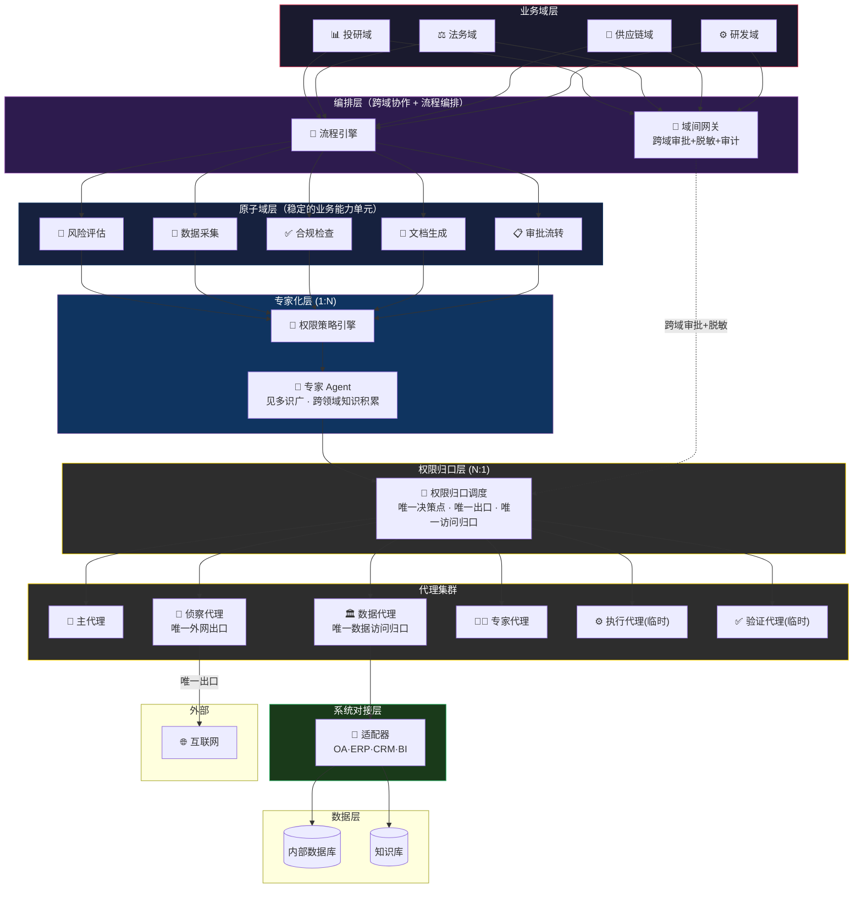

### 7.2 网络分区与数据流向

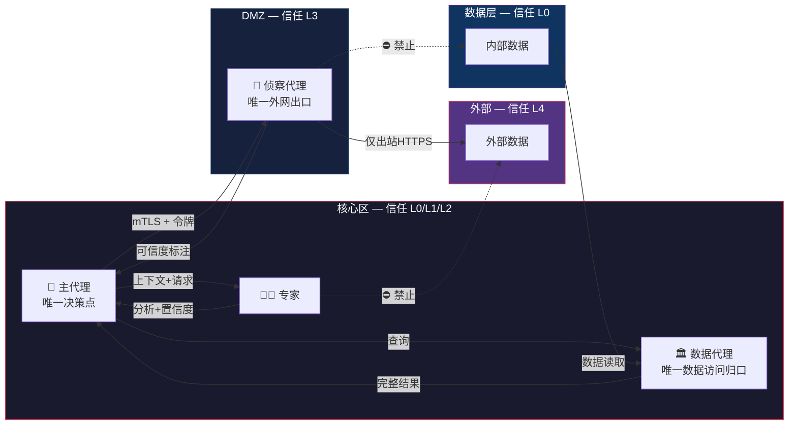

### 7.3 业务架构层次图

```
┌─────────────────────────────────────────────────────────────────┐
│  L6 业务域层    │ 投研域 │ 法务域 │ 供应链域 │ 运营域 │ 研发域 │
├─────────────────┼────────┼────────┼──────────┼────────┼────────┤
│  L5 原子域层    │ 风险评估 · 数据采集 · 合规检查 · 文档生成 · 审批流转 │
├─────────────────┼───────────────────────────────────────────────┤
│  L4 能力层      │ 估值建模 · 供应商评级 · 专利相似度 · 市场数据采集 · │
│                 │ 合规政策检查 · ...（可版本化，可跨域复用）         │
├─────────────────┼───────────────────────────────────────────────┤
│  L3 流程编排层  │ 审批流 · 采购流 · 入职流 · 投研流 · 侵权预警流   │
├─────────────────┼───────────────────────────────────────────────┤
│  L2 代理层      │ 🧠主代理 · 🔭侦察 · 🏛️数据 · 👨‍🔬专家 · ⚙️执行 · ✅验证 │
├─────────────────┼───────────────────────────────────────────────┤
│  L1 系统对接层  │ 🔌OA适配器 · 🔌ERP适配器 · 🔌CRM适配器 · 🔌BI适配器  │
└─────────────────┴───────────────────────────────────────────────┘
```

### 7.4 永久代理生命周期

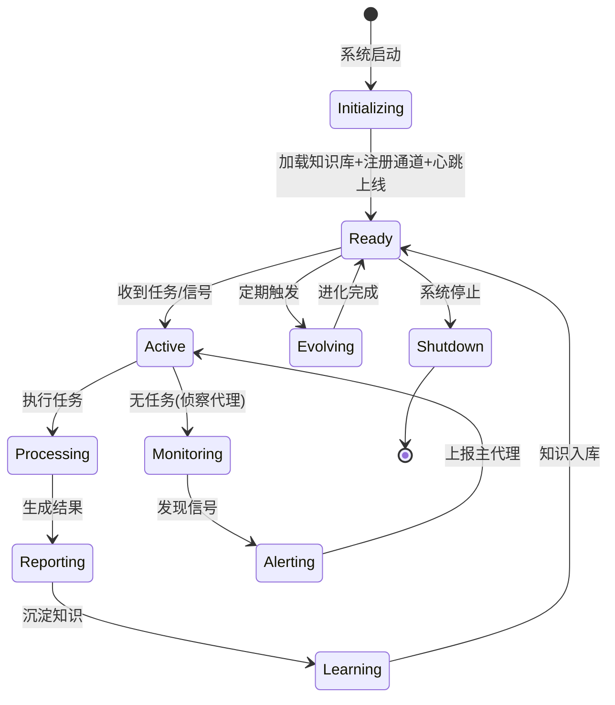

### 7.5 临时代理生命周期

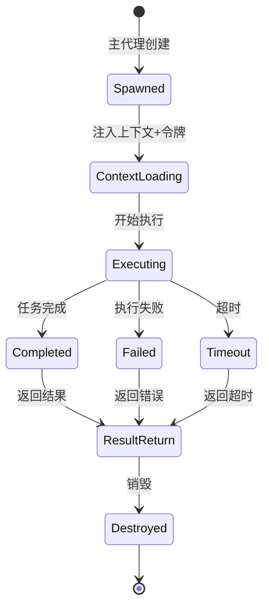

---

## 8. 通信层设计

### 8.1 协议栈

| 层 | 技术选型 | 说明 |
|----|---------|------|
| 传输层 | HTTP/2 + SSE 或 WebSocket | HTTP/2 多路复用；SSE 流式输出；WebSocket 双向实时 |
| 序列化 | JSON-RPC 2.0 | 标准化请求/响应；MessagePack 可选（高性能） |
| 安全 | mTLS 双向认证 + JWT 令牌 | 代理间双向证书验证；令牌控制细粒度权限 |
| 可靠 | 至少一次投递 + 幂等处理 | 消息 ID 去重；死信队列处理异常 |
| 消息中间件 | Redis Stream（轻量）或 NATS（集群） | Redis Stream 单集群；NATS 跨数据中心 |

### 8.2 消息格式

#### 任务下发

```json
{
  "jsonrpc": "2.0",
  "method": "task.execute",
  "id": "task_20260501_001",
  "params": {
    "task_id": "task_20260501_001",
    "target_agent": "scout-01",
    "business_domain": "investment_research",
    "atomic_domain": "data_collection",
    "task_type": "web_research",
    "goal": "搜索 XX 领域最新论文",
    "context": "用户正在进行投研分析...",
    "timeout_seconds": 300,
    "priority": "normal",
    "callback_channel": "result.task_20260501_001",
    "credentials_scope": ["web_search", "web_extract"],
    "created_at": "2026-05-01T10:00:00Z",
    "created_by": "brain"
  }
}
```

#### 告警消息（侦察代理主动推送）

```json
{
  "jsonrpc": "2.0",
  "method": "alert.signal",
  "id": "alert_20260501_001",
  "params": {
    "alert_id": "alert_20260501_001",
    "agent_id": "scout-01",
    "alert_type": "breaking_event",
    "severity": "high",
    "business_domain": "investment_research",
    "topic": "AI前沿追踪",
    "signal": "DeepSeek 发布新模型",
    "source": "https://...",
    "confidence": 0.72,
    "suggested_action": "交专家代理评估",
    "detected_at": "2026-05-01T09:58:00Z"
  }
}
```

#### 跨域协作消息

```json
{
  "jsonrpc": "2.0",
  "method": "domain.collaborate",
  "id": "domain_collab_20260501_001",
  "params": {
    "request_id": "domain_collab_20260501_001",
    "source_domain": "investment_research",
    "target_domain": "legal",
    "atomic_domain": "compliance_check",
    "request_type": "data_access",
    "data_scope": "contract_clauses_for_sector_X",
    "desensitization_level": "internal",
    "requested_by": "brain_investment_research",
    "approved_by": null,
    "created_at": "2026-05-01T10:00:00Z"
  }
}
```

### 8.3 通道 QoS 策略

| 通道 | 投递保证 | 持久化 | 重试 | 超时 |
|------|---------|--------|------|------|
| task.* | 至少一次 | 是 | 3次，指数退避 | 30s确认 |
| result.* | 至少一次 | 是 | 3次 | 按任务设定 |
| alert.* | 尽力投递 | 否 | 0次 | 即时 |
| hb.* | 尽力投递 | 否 | 0次 | 5s |
| audit.* | 至少一次+去重 | 是，不可篡改 | 指数退避至上限 | 24h超时 |
| domain.* | 恰好一次 | 是 | 3次，指数退避 | 60s确认 |

---

## 9. 协作模式

### 9.1 模式一：咨询型（1:N 专家化 + 单 agent）

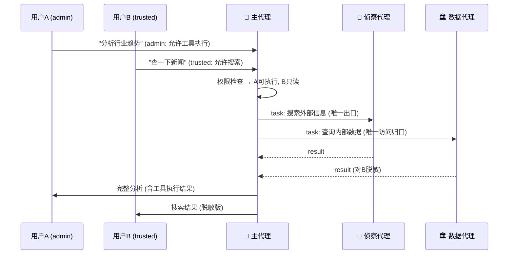

### 9.2 模式二：调度型（N:1 权限归口 + 多 agent）

调度器不是简单的流量路由，而是**权限归口层**——所有请求经调度器鉴权后分发，所有结果经调度器脱敏后返回。

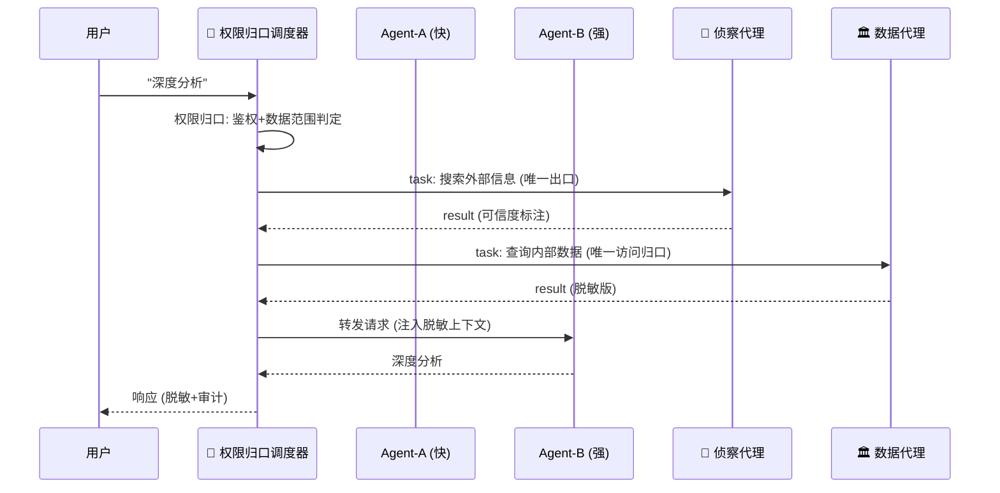

### 9.3 模式三：监控推送型（永久代理主动发现）

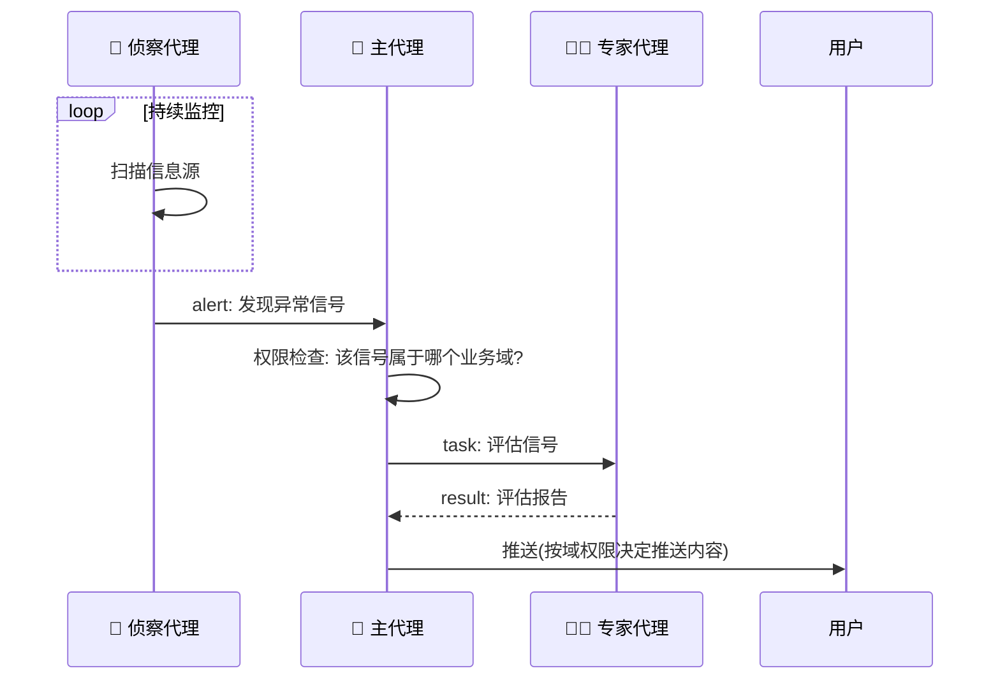

### 9.4 模式四：项目型（临时团队）

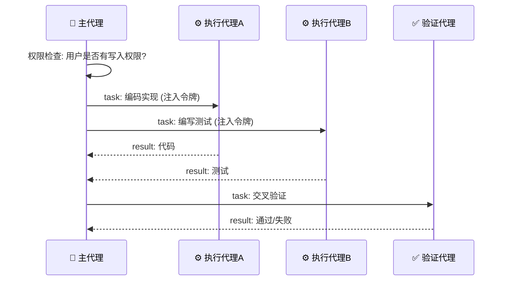

### 9.5 模式五：会诊型（多专家 N:N 协作）

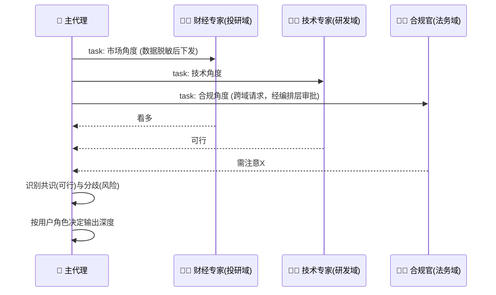

### 9.6 模式六：链式加工型

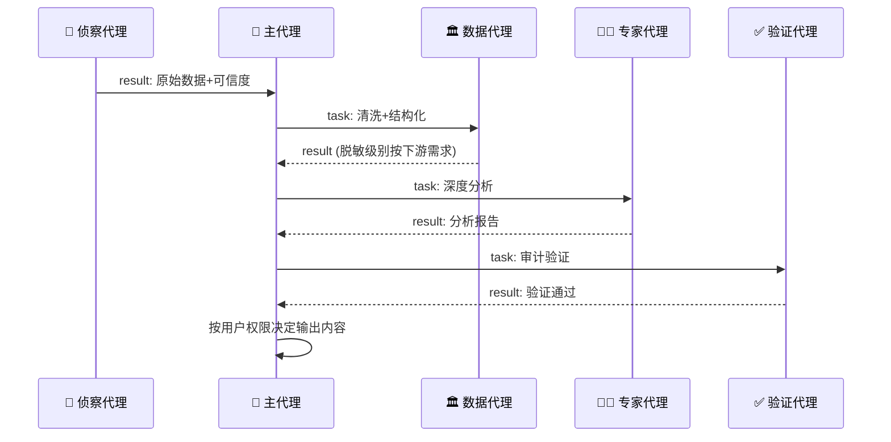

### 9.7 模式七：跨域协作型

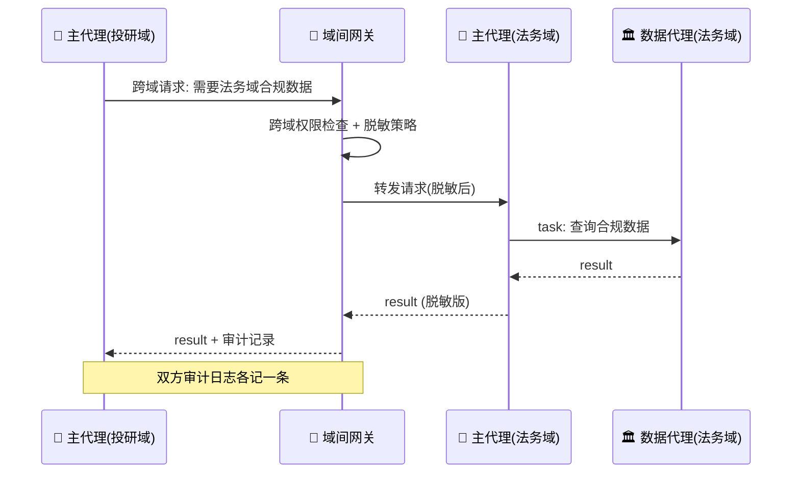

---

## 10. 安全模型

### 10.1 认证与授权

| 机制 | 范围 | 实现 |
|------|------|------|
| mTLS 双向认证 | 代理间通信 | 每个代理持有唯一证书，核心区 CA 签发 |
| JWT 令牌 | 任务级授权 | 主代理签发短期令牌（5分钟），含操作/数据/时间/业务域范围 |
| 用户角色 | 用户级 | admin/trusted/blacklist |
| 群权限 | 群级 | restricted_channels + channel_skill_bindings |
| 数据分级 | 数据级 | public/internal/confidential/restricted/pii |
| 业务域边界 | 域级 | 跨域请求必须经域间网关审批 |

### 10.2 数据保护

| 规则 | 实现 |
|------|------|
| 内部数据不向 DMZ 方向流出原始数据 | 数据代理不向 DMZ 推送原始数据 |
| 外部数据必经清洗 | 侦察代理采集内容必须标注来源和可信度 |
| 跨区通信必经审计 | 所有消息写入审计日志 |
| 脱敏分级 | 按请求方信任等级返回不同粒度数据 |
| 结果大小限制 | 侦察代理单次返回不超过上限 |
| 跨域数据必脱敏 | 跨域数据传输必须按目标域权限等级脱敏 |

### 10.3 审计系统

审计日志仅追加、不可篡改（WORM），保留 365 天。支持按代理、时间、任务ID、业务域检索。异常模式自动检测。**跨域操作双方各记一条审计日志**。

### 10.4 权限归口即安全架构

| 维度 | 分散权限 | 权限归口 |
|------|---------|---------|
| **攻击面** | N个agent各自暴露N个访问入口，攻击面分散但难以统一防护 | 1个出口/入口/决策点=安全策略一致+审计集中（但单点价值更高，需更强的防护） |
| **审计** | N个审计来源，难以关联，容易出现审计盲区 | 1条链路完整可追溯，无审计盲区 |
| **一致性** | N个权限实现，极易出现不一致（A允许但B拒绝） | 1个权限实现，一致性保证 |
| **脱敏** | N个脱敏策略，某个agent忘了脱敏就是安全事故 | 1个脱敏策略，数据代理统一执行 |
| **凭证管理** | N个agent持有凭证，N个泄漏风险 | 凭证仅归口层持有，1个管控点 |
| **故障影响** | 某个agent权限bug→安全漏洞 | 归口层bug可集中修复，影响范围可控 |

---

## 11. 代理生命周期管理

### 11.1 永久代理自我改进

| 机制 | 触发 | 行动 |
|------|------|------|
| 准确率追踪 | 每次分析被验证后 | 记录对/错，计算准确率趋势 |
| 反馈学习 | 用户采纳/拒绝建议 | 采纳→强化；拒绝→分析原因→调整 |
| 知识淘汰 | 每周 | 审查知识库，标记过时/矛盾条目 |
| 跨域关联 | 发现新知识时 | 检查与其他业务域知识的关联（通过编排层） |
| 策略进化 | 准确率持续低于阈值 | 调整分析策略、权重、优先级 |
| **能力反哺** | 域内经验沉淀到原子域 | 其他域的同类专家自动受益 |

**专家化积累**：处理100次投研请求→积累行业模式，处理50次合同审查→积累条款风险点，当两种知识通过原子域能力层交叉→发现"这个行业的合同条款有系统性风险"。这就是专家化——见多识广，且能力可跨域复用。

### 11.2 健康检查与故障恢复

| 检查项 | 频率 | 超时处理 |
|--------|------|---------|
| 心跳 | 30s | 3次缺失→标记不可用→告警 |
| 任务执行 | 按任务超时 | 超时→终止→主代理决定重试或换路 |
| 知识库一致性 | 每小时 | 不一致→从备份恢复→告警 |
| 通信通道 | 每 10s | 断连→指数退避重连→上限后告警 |

**故障隔离**：任一代理异常不影响其他代理继续执行。侦察代理挂了→主代理暂用缓存数据+告警；数据代理挂了→主代理降级为无内部数据模式；**某业务域挂了→其他域正常工作，编排层标记该域不可用**。

### 11.3 双轨执行：固化技能 vs 专家推理

| 维度 | 固化技能 | 专家推理 |
|------|---------|---------|
| 执行引擎 | 确定性规则/脚本 | 大模型推理 |
| 响应时间 | 毫秒级 | 秒级 |
| 可靠性 | 极高（无推理不确定性） | 依赖模型质量 |
| 适用场景 | 定时提醒、日程同步、账单跟踪、格式转换、L1自动审批 | 投研分析、架构评审、合同审查、L3深度审批 |
| 知识来源 | 技能定义 + 配置 | 知识库 + 上下文推理 |
| 故障模式 | 规则匹配失败→升级到专家推理 | 推理超时/质量不足→降级或告警 |

**协同机制**：

```
请求到达 → 固化技能匹配
  ├─ 匹配成功 → 固化技能执行（毫秒级）
  │   └─ 执行失败 → 自动升级到专家推理
  └─ 匹配失败 → 专家Agent推理（秒级）
       └─ 推理结论验证通过 → 可固化为新技能
                         → 下次同类请求毫秒级处理
```

---

## 12. 典型应用场景

> 每个场景标注：**业务域**、**原子域组合**、**服务形态**、**协作模式**、**权限要点**

### 12.1 个人智能助理

**业务域**：个人域  
**原子域组合**：数据采集 + 风险评估 + 审批流转 + 文档生成  
**服务形态**：1:N 专家化  
**协作模式**：咨询型 + 监控推送型

```
个人用户 → 专家Agent(1:N，一个人全部事务的归口)
  日程/财务/健康/知识/社交 → 跨领域关联发现
  → 日程+财务："出差那天正好账单截止日，提前设置自动还款？"

安全归口：所有个人数据→数据代理唯一持有，侦察代理→唯一外网出口
高稳定执行：日常事务→固化技能（毫秒级），理解请求→专家推理
权限要点：用户本人→完整数据，家庭成员(trusted)→共享脱敏版
```

### 12.2 个人驾驶舱

**业务域**：个人域  
**原子域组合**：数据采集 + 风险评估  
**服务形态**：1:N 专家化  
**协作模式**：咨询型 + 监控推送型

```
个人助理的仪表盘：日程/任务/知识/健康/财务一屏掌控
异常主动推送："你本周3个deadline撞车了"
```

### 12.3 智能审批（取代电子流）

**业务域**：运营域  
**原子域组合**：合规检查 + 风险评估 + 审批流转  
**服务形态**：1:N 专家化 + N:N 协作  
**协作模式**：链式加工型 + 咨询型

```
三级审批（→ch11.3双轨执行）：
  L1 自动通过 → 固化技能（毫秒级）
  L2 建议审批 → 专家推理+人工确认
  L3 完整审批 → 多专家深度审查

跨域价值：审批流需要法务域的合规检查 → 通过编排层跨域协作
能力复用：合规检查原子域 → 被审批流、合同审查、合规审计共用
```

### 12.4 智能投研平台

**业务域**：投研域  
**原子域组合**：数据采集 + 风险评估 + 合规检查 + 文档生成  
**服务形态**：1:N 专家化 + N:N 协作  
**协作模式**：咨询型 + 会诊型

```
研究员 → 专家Agent(1:N) → 跨领域发现
系统对接：数据代理→Wind/Bloomberg适配器→行情数据
跨域：需要法务域合规数据 → 编排层审批 → 脱敏后传递
权限要点：admin→完整分析，trusted→脱敏摘要
```

### 12.5 专利监控与侵权预警

**业务域**：法务域  
**原子域组合**：数据采集 + 风险评估 + 合规检查  
**服务形态**：N:N 协作  
**协作模式**：监控推送型 + 链式加工型

```
能力复用：风险评估原子域 → 专利相似度(法务域) + 估值建模(投研域) + 供应商评级(供应链域)
权限归口：侦察代理→唯一外网出口，数据代理→唯一数据访问归口
```

### 12.6 安全合规审计

**业务域**：法务域  
**原子域组合**：合规检查 + 数据采集  
**服务形态**：N:N 协作  
**协作模式**：链式加工型

```
合规检查原子域 → 被审计、审批、合同审查共用
审计日志不可篡改，全链路可追溯
```

### 12.7 供应链风控监控

**业务域**：供应链域  
**原子域组合**：数据采集 + 风险评估  
**服务形态**：N:N 协作  
**协作模式**：监控推送型 + 链式加工型

```
能力复用：风险评估原子域 → 供应商评级(供应链) + 估值建模(投研)
系统对接：数据代理→ERP适配器→采购数据
```

### 12.8 智能驾驶舱（团队/项目/能力/执行）

**业务域**：运营域  
**原子域组合**：数据采集 + 风险评估 + 审批流转  
**服务形态**：1:N 专家化 + N:1 权限归口 + N:N 协作  
**协作模式**：咨询型 + 监控推送型 + 调度型

```
五种驾驶舱，同一架构，不同视角：
  个人驾驶舱 → 我的日程/任务/知识/健康/财务
  团队驾驶舱 → 成员负载/协作瓶颈/团队健康度
  项目驾驶舱 → 进度/风险/资源/里程碑
  能力驾驶舱 → 技能覆盖率/知识缺口/组织能力图谱
  执行驾驶舱 → 任务执行率/阻塞项/SLA达标率

数据流：数据代理→唯一数据访问归口，按驾驶舱角色脱敏
```

### 12.9 研发效能平台

**业务域**：研发域  
**原子域组合**：风险评估 + 文档生成 + 合规检查  
**服务形态**：1:N 专家化 + N:1 权限归口  
**协作模式**：咨询型 + 项目型

```
跨项目洞察：A的架构+B的性能问题=统一优化方案
系统对接：数据代理→Git/JIRA适配器→代码/任务数据
```

### 12.10 其他场景

| 场景 | 业务域 | 原子域组合 | 核心价值 |
|------|--------|----------|---------|
| 多群信息分发 | 运营域 | 数据采集+文档生成 | 一个专家agent跨群积累知识 |
| 技术架构评审 | 研发域 | 风险评估+合规检查 | 多专家会诊+数据归口 |
| 跨部门战略决策 | 运营域 | 风险评估+数据采集+合规检查 | 多域协作，不同人看不同深度 |
| 法律文书审查 | 法务域 | 合规检查+文档生成 | 合规检查能力复用 |
| PPTX智能生成 | 运营域 | 文档生成+数据采集 | 调度器按主题路由 |
| 智能客服 | 运营域 | 数据采集+风险评估+审批流转 | 知识跨场景积累 |
| 企业知识助手 | 运营域 | 数据采集+文档生成 | 跨部门知识积累 |
| 知识体系构建 | 运营域 | 数据采集+风险评估 | 跨领域知识图谱 |

---

## 13. 与现有架构的差距与演进路径

### 13.1 差距分析

| 能力 | 现状 | 目标 | 差距 |
|------|------|------|------|
| 业务域 | 无 | 业务域边界+原子域+能力复用 | 需业务建模层 |
| 原子域 | 无 | 稳定的业务能力单元，可跨域复用 | 需原子域划分+能力注册表 |
| 领域动态组合 | 无 | 按需组合/拆分业务域 | 需组合引擎（思想占位，待落地） |
| 流程编排 | 无 | 跨角色/跨步骤/跨系统的业务流程 | 需流程引擎+状态管理 |
| 系统对接 | 数据代理直连数据库 | 适配器层封装OA/ERP/CRM/BI | 需适配器框架+统一接口 |
| 用户权限 | ✅ admin/trusted/blacklist + restricted_channels | 完整RBAC + 业务域权限 | 需域级权限+跨域审批 |
| 群权限 | ✅ 三道防线 | 群级完整权限矩阵 | 需细化工具级权限 |
| 技能绑定 | ✅ channel_skill_bindings | 所有平台支持 | 需扩展到 Telegram 等 |
| 代理间通信 | 进程内函数调用 | 跨网络消息总线 | 需新建通信层 |
| 代理调度 | smart_model_routing | 多维度路由+权限归口 | 需归口层 |
| 代理生命周期 | 临时(delegate_task) | 永久+临时 | 需常驻进程管理 |
| 安全分区 | 单机无分区 | 核心区/DMZ隔离 | 需网络架构 |
| 审计追溯 | 无 | 全链路不可篡改审计 | 需审计系统 |
| 数据脱敏 | 无 | 按请求方等级+业务域脱敏 | 需脱敏引擎 |
| 固化技能执行 | 无 | 毫秒级确定性执行 | 需固化技能引擎 |
| 驾驶舱 | 无 | 五种驾驶舱 | 需驾驶舱UI+数据汇聚层 |
| 智能审批 | 无 | 三级审批机制 | 需审批流程引擎 |
| 故障隔离 | 单进程 | 代理间+域间故障隔离 | 需多进程架构 |

### 13.2 演进路径

#### Phase 0：业务建模（前置条件）

**目标**：定义业务域和原子域

- 识别企业核心业务域（投研/法务/供应链/运营/研发）
- 划分原子域（风险评估/数据采集/合规检查/文档生成/审批流转）
- 建立能力注册表（原子域→能力→版本→复用域）
- **原子域划分标准、动态组合机制、进化模型——留为思想占位**

#### Phase 1：权限完善 + 单机多进程（MVP）

**目标**：完善现有权限体系 + 验证多代理协作可行性

- 工具级权限（denied_tools per channel）
- 主代理 + 侦察代理独立进程
- Redis Stream 单机通信
- 固化技能引擎
- Docker Compose 部署

#### Phase 2：网络分区 + 权限归口层 + 系统对接

**目标**：核心区/DMZ 分离 + 权限归口调度 + 系统适配器

- 侦察代理部署到 DMZ
- mTLS 双向认证
- 权限归口调度器
- 数据脱敏引擎
- 系统适配器框架（OA/ERP/CRM/BI适配器）
- L1自动审批

#### Phase 3：业务域 + 原子域 + 流程编排 + 驾驶舱

**目标**：业务域边界 + 原子域能力复用 + 流程引擎 + 驾驶舱

- 业务域边界实施
- 原子域能力注册与复用
- 跨域编排层
- 流程引擎（审批流/采购流/入职流）
- 五种驾驶舱
- L2/L3智能审批

#### Phase 4：领域动态组合 + 进化（探索性）

**目标**：原子域的动态组合与进化

- 原子域组合的触发机制探索
- 领域融合的度量与验证
- 能力版本自动升级
- 组织扁平化驱动的域边界调整
- **此阶段为探索性——具体落地方式待验证**

#### Phase 5：生产就绪

**目标**：企业级可靠性

- 高可用 + 故障隔离
- 全链路追踪（OpenTelemetry）
- Kubernetes 部署
- 监控告警

---

## 14. 附录A：消息协议定义

### JSON-RPC 2.0 方法清单

| 方法 | 方向 | 通道 | 说明 |
|------|------|------|------|
| `task.execute` | 主→子 | task.* | 下发任务 |
| `task.cancel` | 主→子 | task.* | 取消任务 |
| `result.submit` | 子→主 | result.* | 提交结果 |
| `result.stream` | 子→主 | result.* | 流式提交 |
| `alert.signal` | 子→主 | alert.* | 主动告警 |
| `alert.ack` | 主→子 | alert.* | 确认告警 |
| `hb.ping` | 子→主 | hb.* | 心跳 |
| `hb.pong` | 主→子 | hb.* | 心跳确认 |
| `audit.log` | 所有→审计 | audit.* | 审计日志 |
| `config.update` | 主→子 | task.* | 配置热更新 |
| `knowledge.sync` | 专家↔知识库 | task.* | 知识同步 |
| `permission.check` | 子→主 | task.* | 权限校验请求 |
| `permission.grant` | 主→子 | result.* | 临时授权 |
| `domain.collaborate` | 域间 | domain.* | 跨域协作请求 |
| `domain.approve` | 域间 | domain.* | 跨域协作审批 |
| `domain.reject` | 域间 | domain.* | 跨域协作拒绝 |

### 错误码

| 码 | 含义 |
|----|------|
| -32700 | JSON 解析错误 |
| -32600 | 无效请求 |
| -32601 | 方法不存在 |
| -32602 | 参数无效 |
| -32603 | 内部错误 |
| -32001 | 代理不可用 |
| -32002 | 任务超时 |
| -32003 | 权限不足 |
| -32004 | 数据脱敏失败 |
| -32005 | 知识库不一致 |
| -32006 | 令牌过期 |
| -32007 | 证书无效 |
| -32008 | 群权限拒绝 |
| -32009 | 用户角色不足 |
| -32010 | 数据分级冲突 |
| -32011 | 跨域协作被拒绝 |
| -32012 | 业务域不可用 |
| -32013 | 原子域能力未注册 |

---

## 15. 附录B：权限策略配置参考

### 完整群权限配置

```yaml
gateway:
  user_roles:
    admin:
      - ou_d366ba075912a3865430a7fe7020454b
    trusted:
      - ou_trusted_user_1
      - ou_trusted_user_2

  restricted_channels:
    oc_6ed1cc645057da3bbe93c6120219a61e:  # AI日报群
      users:
        - id: ou_d366ba075912a3865430a7fe7020454b
          role: admin
        - id: ou_trusted_user_1
          role: trusted
      allowed_commands: []
      allowed_toolsets:
        - web
        - file
      denied_tools:
        - terminal
        - write_file
        - skill_manage
        - memory
      max_iterations_per_user: 30
      blacklist:
        - ou_blacklisted_user

feishu:
  channel_skill_bindings:
    - id: "oc_6ed1cc645057da3bbe93c6120219a61e"
      skills: ["group-thinking", "source-evolution", "core-thinking"]
  channel_prompts:
    "oc_6ed1cc645057da3bbe93c6120219a61e": |
      你是AI日报群的助手。
      ✅ 允许：回答问题、搜索信息、推送日报
      ❌ 禁止：修改技能、执行命令、有副作用的操作
```

### 业务域配置

```yaml
business_domains:
  investment_research:
    name: "投研域"
    atomic_domains: [risk_assessment, data_collection, compliance_check, document_generation]
    data_boundary: [portfolios, research_reports, market_data]
    system_adapters: [wind, bloomberg, trading_system]
    
  legal:
    name: "法务域"
    atomic_domains: [risk_assessment, compliance_check, document_generation]
    data_boundary: [contracts, patents, regulations]
    system_adapters: [contract_management, patent_db]
    
  supply_chain:
    name: "供应链域"
    atomic_domains: [risk_assessment, data_collection, approval_flow]
    data_boundary: [suppliers, procurement, inventory]
    system_adapters: [erp, logistics_tracking]

atomic_domains:
  risk_assessment:
    capabilities:
      - name: valuation_modeling
        version: v3
        domains: [investment_research]
      - name: supplier_rating
        version: v2
        domains: [supply_chain]
      - name: patent_similarity
        version: v3
        domains: [legal]
  compliance_check:
    capabilities:
      - name: policy_compliance_check
        version: v2
        domains: [investment_research, legal, supply_chain]
```

### 代理信任等级配置

```yaml
agents:
  brain:
    trust_level: L0
    network_zone: core
    allowed_outbound: [vault, expert, scout, worker, auditor]
  
  scout:
    trust_level: L3
    network_zone: dmz
    allowed_outbound: [brain]
    allowed_external: true
    max_result_size_kb: 512
  
  vault:
    trust_level: L1
    network_zone: core
    allowed_outbound: [brain]
    data_access: read_only
    desensitization: true
    system_adapters: [wind, bloomberg, erp, oa, crm, bi]
  
  expert:
    trust_level: L2
    network_zone: core
    allowed_outbound: [brain]
    direct_data_access: false
    direct_external: false
    cross_domain: false  # 不直连其他域的agent
```
