# 分布式多代理协作架构设计

> **版本**：v2.0  
> **日期**：2026-05-01  
> **定位**：企业级 AI 代理集群的架构规范，覆盖代理分类、服务形态、权限体系、通信协议、协作模式、安全模型与企业应用

---

## 目录

1. [设计目标](#1-设计目标)
2. [代理分类体系](#2-代理分类体系)
3. [六种代理角色](#3-六种代理角色)
4. [四种服务形态](#4-四种服务形态)
5. [权限控制体系](#5-权限控制体系)
6. [系统架构图](#6-系统架构图)
7. [通信层设计](#7-通信层设计)
8. [协作模式](#8-协作模式)
9. [安全模型](#9-安全模型)
10. [代理生命周期管理](#10-代理生命周期管理)
11. [典型企业应用场景](#11-典型企业应用场景)
12. [与现有架构的差距与演进路径](#12-与现有架构的差距与演进路径)
13. [附录A：消息协议定义](#13-附录a消息协议定义)
14. [附录B：权限策略配置参考](#13-附录b权限策略配置参考)

---

## 1. 设计目标

### 1.1 核心原则

| 原则 | 含义 |
|------|------|
| **网络分区感知** | 代理部署位置决定其网络可达性和信任等级，架构天然适配企业安全边界 |
| **永久与临时分离** | 知识资产（永久代理）持续进化；执行资源（临时代理）按需调度、用完释放 |
| **推拉结合** | 永久代理可主动推送信号（监控型）；临时代理被动响应指令（执行型） |
| **决策归口** | 主代理是唯一的决策出口，子代理只提供输入和建议 |
| **全链路可审计** | 代理间所有通信和操作写入不可篡改的审计日志 |
| **权限即架构** | 权限不是附加功能，是每一层（虚拟化、调度、协作、数据）的横切骨架 |
| **多租户原生** | 单 agent 通过权限隔离服务多用户/群，多 agent 通过调度器服务同一用户 |

### 1.2 设计约束

- 主代理不可直接访问外网
- 内部数据只出不进（数据代理返回结果给核心区，不向 DMZ 推送原始数据）
- 外部数据必经清洗和可信度标注
- 跨区通信必须经过认证和加密
- 临时代理无持久化、无记忆、无网络直连
- 权限变更热加载，不中断服务

---

## 2. 代理分类体系

### 2.1 按生命周期

| 维度 | 永久代理 | 临时代理 |
|------|---------|---------|
| 本质 | 组织的知识资产，持续进化 | 项目的人力资源，用完释放 |
| 类比 | 全职员工 | 外包/顾问 |
| 状态 | 持久记忆 + 领域知识 + 偏好模型 | 仅任务上下文 |
| 部署 | 固定节点，网络分区感知 | 随编排者调度，无固定位置 |
| 改进 | 自我学习 + 人工反馈 + 知识沉淀 | 不改进，每次从基线开始 |
| 成本 | 持续占资源，边际成本低 | 按次计费，峰值成本高 |
| 示例 | 主代理、侦察代理、数据代理、专家代理 | 执行代理、验证代理 |

### 2.2 按网络位置

| 维度 | 核心区（内网） | 边界区（DMZ） | 外部 |
|------|-------------|-------------|------|
| 访问范围 | 内部全部数据 | 内部受限 + 外网 | 仅外网 |
| 信任等级 | 最高信任 | 中等信任，受控出口 | 不信任 |
| 数据流向 | 自由读写内部 | 只读内部受限 + 读写外部 | 只读外部 |
| 典型部署 | 主代理、数据代理、专家代理 | 侦察代理、网关代理 | 第三方 API、外部知识源 |

### 2.3 分类矩阵

```
              │  核心区        │  DMZ          │  外部
──────────────┼───────────────┼───────────────┼──────────────
永久代理       │ 🧠主代理       │ 🔭侦察代理     │  —
              │ 🏛️数据代理     │               │
              │ 👨‍🔬专家代理    │               │
──────────────┼───────────────┼───────────────┼──────────────
临时代理       │ ⚙️执行代理     │ 临时侦察任务    │  —
              │ ✅验证代理     │               │
```

---

## 3. 六种代理角色

### 3.1 🧠 主代理（Brain）— 永久 · 核心区

**职责**：意图理解、任务编排、决策、跨代理协调、权限执行

**核心能力**：
- 接收用户请求，匹配十大主题分类，确定认知推理范式
- 拆解任务为子任务，选择合适的代理和协作模式
- 整合子代理结果，做出最终决策
- 管理永久话题（知识体系、信息收集、前沿追踪、技能体系）
- **执行权限策略**：根据用户角色和群配置，决定允许/拒绝操作

**硬约束**：
- 不直接访问外网
- 不直接操作数据库
- 所有决策必须可追溯（记录推理链）
- 权限检查先于任务执行

**接口**：
```
输入：用户请求 / 子代理上报（结果、告警、心跳）
输出：最终响应 / 任务下发 / 策略调整 / 权限拒绝
```

### 3.2 🔭 侦察代理（Scout）— 永久/临时 · 边界区

**职责**：外部信息采集、情报收集、环境感知

**两种运行模式**：

| 模式 | 触发 | 行为 | 类比 |
|------|------|------|------|
| 永久模式 | 系统启动 | 持续监控 RSS/API/网站，发现信号主动上报 | 哨兵 |
| 临时模式 | 主代理指令 | 执行特定搜索任务，返回结果后待命 | 斥候 |

**核心能力**：
- 多源信息采集（网页、API、RSS、社交媒体）
- 采集内容自动标注：来源、时间、可信度、相关性
- 信号检测：异常波动、新出现的关键词、模式变化
- 主动推送：发现高价值信号时通过告警通道立即上报

**硬约束**：
- 不知内网结构
- 不存储内部数据
- 所有采集结果必须带可信度评分
- 单次采集结果大小受限（防数据外泄通道）

### 3.3 🏛️ 数据代理（Vault）— 永久 · 核心区

**职责**：内部数据访问、知识库管理、数据治理

**核心能力**：
- 读取内部数据库、知识库、文档系统、代码仓库
- 数据脱敏：根据请求方身份和权限等级决定返回完整数据还是脱敏版本
- 数据质量守门：脏数据不入库，可疑数据标注风险
- 访问审计：记录谁查了什么、什么时候查的

**硬约束**：
- 不修改数据源（只读，写入需主代理审批）
- 不向 DMZ 方向推送原始数据
- 查询结果必须脱敏后才能发送给核心区以外的代理
- 数据访问遵循最小权限原则

### 3.4 👨‍🔬 专家代理（Expert）— 永久 · 核心区

**职责**：领域深度分析、专业判断、知识演进

**专家类型**：

| 专家 | 领域 | 核心技能 | 典型输出 |
|------|------|---------|---------|
| 财经分析师 | 投研/宏观/行业 | 估值建模、研报解读、风险预警 | 投资建议、风险报告 |
| 专利分析师 | 专利/知识产权 | 检索、相似度、侵权检测、价值评估 | 侵权预警、专利地图 |
| 技术架构师 | 架构/工程 | 技术选型、代码审查、性能诊断 | 架构评审、优化方案 |
| 合规官 | 法务/监管 | 政策解读、合规检查、风险评估 | 合规报告、整改建议 |

**自我改进机制**：
- 分析准确率追踪 → 策略调整
- 用户反馈（采纳/拒绝）→ 知识库更新
- 跨领域关联发现 → 扩展知识边界
- 定期知识库审查 → 淘汰过时知识

**硬约束**：
- 不直接访问数据源（通过数据代理获取）
- 不直接访问外网（通过侦察代理获取）
- 专业判断必须附带置信度和证据链

### 3.5 ⚙️ 执行代理（Worker）— 临时 · 按需调度

**职责**：具体编码、文档生成、数据处理等执行任务

**硬约束**：
- 无记忆：不持有跨任务状态
- 无持久化：不写入任何永久存储
- 无网络：不直接联网
- 受限时：必须在规定时间内完成
- 权限受限：只能访问本次任务上下文中声明的资源

### 3.6 ✅ 验证代理（Auditor）— 临时 · 按需调度

**职责**：交叉验证、质量审计、合规检查

**验证维度**：

| 维度 | 检查内容 |
|------|---------|
| 事实准确性 | 数据是否与来源一致，计算是否正确 |
| 逻辑一致性 | 推理链是否完整，结论是否从前提得出 |
| 合规性 | 是否违反安全策略、数据保护规则 |
| 完整性 | 是否有遗漏、是否覆盖所有要求 |
| 权限合规 | 操作是否在权限范围内 |

**硬约束**：
- 独立于执行链，由主代理直接调度
- 审计日志不可篡改
- 验证失败必须给出具体原因和修复建议

---

## 4. 四种服务形态

### 4.1 形态一：单代理虚拟化服务（1:N）

**一个 agent 集中服务多个用户/群——本质是专家化，不是共享。**

```
        用户A (投研)    ──┐
        用户B (法务)    ──┤     ┌────────────────────────────┐
        用户C (技术)    ──┤────►│   专家 Agent                │
        群X (AI日报)   ──┤     │                             │
        群Y (财经群)   ──┘     │   处理A的问题 → 积累投研知识  │
                                 │   处理B的问题 → 积累法务知识  │
                                 │   处理C的问题 → 积累技术知识  │
                                 │                             │
                                 │   跨领域关联：投研+法务=合规投研│
                                 │   越用越强，见多才能识广       │
                                 │                             │
                                 │   + 权限隔离层               │
                                 │   + 群技能绑定               │
                                 └────────────────────────────┘
```

**为什么集中，而不是每人一个 agent？**

| 分散（每人一个agent） | 集中（1:N专家agent） |
|---------------------|---------------------|
| 每个agent只见过自己领域的问题 | 一个agent见过所有领域的问题 |
| 永远无法发现跨领域关联 | 投研+法务→合规投研，技术+市场→技术商业化 |
| 知识碎片化，无法积累深度 | 知识集中积累，越用越专业 |
| 10个用户=10个浅薄agent | 10个用户=1个越来越强的专家 |
| 每个agent维护成本独立 | 一次维护，所有用户受益 |

**核心本质：见多识广**

```
用户A问：XX行业趋势如何？
  → 专家agent处理 → 积累行业知识

用户B问：XX合同条款有无法律风险？
  → 专家agent处理 → 积累法务知识
  → 同时发现：A的行业趋势中提到的政策变化，正是B的合同条款风险的根因
  → 跨领域洞察：主动告知A和B，"你们的问题其实是同一个"

这就是分散agent永远做不到的——它们彼此不认识。
```

**权限隔离：让同一个专家对不同人表现出不同边界**

| 层 | 机制 | 作用 |
|----|------|------|
| **命令隔离** | `restricted_channels` 命令过滤 | 受限群禁止执行命令、修改技能等有副作用操作 |
| **工具隔离** | `restricted_channels` 工具集过滤 | 受限群只允许只读工具（搜索、查询），禁止写操作 |
| **技能隔离** | `channel_skill_bindings` | 不同群绑定不同技能组合（AI群→AI技能，财经群→财经技能） |

**提示词隔离**：

| 机制 | 作用 | 实现 |
|------|------|------|
| `channel_prompts` | 按群注入不同的系统提示 | 群X提示"你是一个AI分析师"，群Y提示"你是一个财经顾问" |
| 群 SOUL.md | 群级角色覆盖 | `~/.hermes/groups/{chat_id}/SOUL.md` |
| 群 MEMORY.md | 群级记忆 | `~/.hermes/groups/{chat_id}/MEMORY.md` |

**用户级隔离**：

| 机制 | 作用 | 状态 |
|------|------|------|
| `user_roles` (admin/trusted/blacklist) | 用户能做什么 | ✅ 已实现 |
| 用户偏好画像 | 同群不同用户看到不同内容排序 | ❌ 待实现 |
| 会话级资源配额 | 防止单用户耗尽 agent 迭代预算 | ❌ 待实现 |

**优势**：
- **专家化**：一个agent处理多领域问题，积累跨领域知识，越用越强
- **跨领域洞察**：分散agent做不到的关联发现
- **维护成本低**：一次维护所有用户受益
- 配置简单，权限变更即时生效

**局限**：
- 单点瓶颈：agent 是单进程，高并发时排队
- 权限设计必须严谨：共享专家，必须确保A的知识不泄漏给B
- 群记忆隔离需完善：当前共享 MEMORY.md，需群级隔离

### 4.2 形态二：多代理虚拟化调度（N:1）

**多个 agent 按需调度，服务于同一个用户/请求——本质是权限归口，不是流量分发。**

```
        用户请求 ──────► 调度/数据代理 ─────┬──► Agent-A（快模型，简单问答）
                                        ├──► Agent-B（强模型，深度分析）
                                        └──► Agent-C（专家模型，领域问题）
                                             用户只看到"一个"助手

        所有外网请求 ────► 只有侦察代理能出 ────► 一个出口，一个审计点
        所有内部数据 ────► 只有数据代理能读 ────► 一个入口，一个脱敏点
        所有权限判定 ────► 只有主代理能判   ────► 一个决策点，一个策略引擎
```

**为什么集中调度/数据访问，而不是每个agent自己管？**

| 分散权限（每个agent自己管） | 集中归口（调度/数据代理统一管） |
|-------------------------|---------------------------|
| 10个agent=10个权限实现 | 权限逻辑只实现一次 |
| 必然出现不一致：A允许但B拒绝同样的操作 | 一致性保证：所有请求必经此点 |
| 审计分散：10个agent各自记录，难以关联 | 审计集中：一条链路完整可追溯 |
| 脱敏分散：每个agent自己判断脱敏策略 | 脱敏集中：数据代理统一执行，策略一致 |
| 新增agent必须重新实现权限逻辑 | 新增agent只需声明能力，权限由归口层控制 |

**核心本质：权限归口**

```
没有归口层：
  Agent-A 直接访问数据库 → A自己判断权限 → A的权限逻辑可能有bug
  Agent-B 直接访问外网   → B自己判断什么能抓 → B可能抓了不该抓的
  Agent-C 直接返回数据   → C自己判断脱敏   → C可能忘了脱敏PII

有归口层：
  所有数据请求 → 数据代理（唯一有DB权限的）→ 脱敏 → 返回
  所有外网请求 → 侦察代理（唯一有外网权限的）→ 标注可信度 → 返回
  所有权限判定 → 主代理（唯一有策略引擎的）→ 允许/拒绝 → 执行

  权限逻辑只写一次，审计只有一个来源，脱敏只有一个策略。
```

**调度策略**：

| 策略 | 触发条件 | 路由目标 | 示例 |
|------|---------|---------|------|
| 复杂度路由 | 输入长度 < 160字符 | 快模型 Agent | "今天天气？" → Agent-A |
| 主题路由 | 匹配十大主题分类 | 对应专家 Agent | "分析这份研报" → Agent-B |
| 技能路由 | 请求触发特定技能 | 预装该技能的 Agent | "生成PPT" → Agent-C |
| 负载路由 | 当前 Agent 负载 > 阈值 | 空闲 Agent | 高峰期 → 备用 Agent |
| 降级路由 | Agent 响应超时 | 备用 Agent | Agent-A 超时 → Agent-D |

**现有基础**：

| 能力 | 现有实现 | 差距 |
|------|---------|------|
| 复杂度路由 | `smart_model_routing`（按输入长度） | 仅区分简单/复杂，不区分主题 |
| 主题路由 | 无 | 需意图分类器 + 主题→Agent 映射 |
| 技能路由 | `channel_skill_bindings`（按群绑定） | 需扩展为按请求动态绑定 |
| 负载路由 | 无 | 需 Agent 池 + 健康检查 |
| 会话连续性 | 同一 session 保持同一 Agent | 跨 Agent 切换时需上下文传递 |

**优势**：
- **权限归口**：所有权限逻辑集中实现，一致性保证
- **审计集中**：一条链路完整可追溯
- **脱敏统一**：数据代理统一执行，不会出现某个agent忘了脱敏
- 用户无感：一个入口，后端自动选最优 Agent
- 弹性伸缩：高峰期扩容 Agent 池

**局限**：
- 归口层是单点——需要高可用设计
- 跨 Agent 会话连续性需额外处理
- 归口层性能是系统瓶颈

### 4.3 形态三：多对多协作（N:N）

**多个 agent 之间对等协作，没有固定主从。**

```
    Agent-A (财经专家) ◄────► Agent-B (技术专家)
         ▲                         │
         │                         ▼
    Agent-C (合规官)   ◄────► Agent-D (数据代理)
         │
         ▼
    Agent-E (侦察代理) ────► 外部信息源
```

**核心问题**：agent 之间如何发现彼此、建立通信、协调工作？

**发现与注册**：

| 机制 | 说明 |
|------|------|
| 服务注册表 | 每个 agent 启动时向注册中心注册（ID、角色、能力、地址） |
| 能力声明 | agent 声明自己能做什么（技能列表、数据范围、主题覆盖） |
| 心跳保活 | 定期发送心跳，注册中心维护可用 agent 列表 |
| 动态发现 | 主代理或编排引擎按需查询注册中心，匹配能力需求 |

**协作拓扑**：

| 拓扑 | 适用场景 | 示例 |
|------|---------|------|
| 星型（主从） | 有明确决策者 | 主代理→多专家→主代理 |
| 网状（对等） | 无明确主从，需要协商 | 多专家会诊，共识/分歧识别 |
| 链型（流水线） | 数据逐步加工 | 采集→清洗→分析→验证→输出 |
| 环型（迭代） | 需要多轮迭代 | 分析→验证→修改→再验证→... |

**优势**：
- 最灵活的协作模式
- 任何 agent 可与任何 agent 通信
- 支持复杂的多步推理和决策

**局限**：
- 最复杂的架构，需要消息总线、编排引擎、审计系统
- 一致性保证困难（分布式系统问题）
- 成本最高

### 4.4 形态四：混合模式（实际生产形态）

**三层叠加，从底到顶：1:N 虚拟化 → N:1 调度 → N:N 协作**

```
    ┌─────────────── Layer 3: N:N 协作层 ──────────────────┐
    │  agent 间消息总线 + 编排引擎 + 审计 + 服务注册         │
    └───────────────────┬─────────────────────────────────┘
                        │
    ┌───────────────────▼ Layer 2: N:1 调度层 ──────────────┐
    │  按请求复杂度/主题/技能 路由到不同 agent                │
    │  smart_model_routing + 主题路由 + 技能路由             │
    └───────────────────┬─────────────────────────────────┘
                        │
    ┌───────────────────▼ Layer 1: 1:N 虚拟化层 ────────────┐
    │  单 agent 实例 + 权限隔离 + 群技能绑定 + 用户角色       │
    │  restricted_channels + user_roles + channel_bindings  │
    └──────────────────────────────────────────────────────┘
```

**各层职责**：

| 层 | 核心问题 | 解决方案 | 权限需求 |
|----|---------|---------|---------|
| L1 虚拟化 | 一个 agent 服务多人 | 权限隔离 + 群绑定 | 用户能做什么 |
| L2 调度 | 请求到哪个 agent | 主题/复杂度/技能路由 | 哪个 agent 处理 |
| L3 协作 | agent 间怎么通信 | 消息总线 + 编排引擎 | agent 间谁能通信、访问什么数据 |

**权限是横切骨架**：

```
    ┌──────────────────────────────────────────────────────┐
    │                    权限策略引擎                         │
    │  ┌──────────┐  ┌──────────┐  ┌──────────┐           │
    │  │ 用户权限  │  │ 代理权限  │  │ 数据权限  │           │
    │  │ (L1)     │  │ (L2/L3)  │  │ (全层)    │           │
    │  └──────────┘  └──────────┘  └──────────┘           │
    └──────────────────────────────────────────────────────┘
         ↓ 切入             ↓ 切入            ↓ 切入
    L1 虚拟化层         L2 调度层         L3 协作层
```

---

## 5. 权限控制体系

### 5.1 权限模型总览

权限不是单一维度，而是**四个正交维度**的组合：

```
权限 = f(谁, 在哪, 做什么, 访问什么数据)

谁   → 用户身份 (user_id) + 用户角色 (role)
在哪 → 上下文 (群/频道/会话) + 网络区 (核心/DMZ/外部)
做什么 → 操作类型 (命令/工具/技能/通信)
访问什么 → 数据范围 (公开/内部/机密/受限)
```

### 5.2 用户角色体系

#### 角色定义

| 角色 | 权限范围 | 典型用户 |
|------|---------|---------|
| `admin` | 全部权限：命令执行、技能管理、配置变更、数据写入、用户管理 | 管理员 |
| `trusted` | 大部分权限：问答、搜索、工具使用、数据读取；禁止配置变更和用户管理 | 高级用户 |
| `observer` | 只读权限：问答、搜索；禁止工具执行和任何写操作 | 普通用户 |
| `blacklist` | 禁止交互 | 被封禁用户 |

#### 角色继承与覆盖

```
全局默认角色 (config.yaml: gateway.user_roles)
  ↓ 群级覆盖
群角色 (restricted_channels.{chat_id}.users[].role)
  ↓ 会话级覆盖
临时提权/降权 (管理员手动操作)
```

**优先级**：会话级 > 群级 > 全局级

#### 角色能力矩阵

| 能力 | admin | trusted | observer | blacklist |
|------|-------|---------|----------|-----------|
| 问答/对话 | ✅ | ✅ | ✅ | ❌ |
| 搜索/查询 | ✅ | ✅ | ✅ | ❌ |
| 工具执行（只读） | ✅ | ✅ | ✅ | ❌ |
| 工具执行（写入） | ✅ | ✅ | ❌ | ❌ |
| 技能管理 | ✅ | ❌ | ❌ | ❌ |
| 命令执行 | ✅ | ❌ | ❌ | ❌ |
| 配置变更 | ✅ | ❌ | ❌ | ❌ |
| 用户管理 | ✅ | ❌ | ❌ | ❌ |
| 数据写入 | ✅ | ✅ (受限) | ❌ | ❌ |

### 5.3 群/频道级权限

#### 三道防线（已实现）

| 防线 | 位置 | 作用 | 实现 |
|------|------|------|------|
| **命令过滤** | `gateway/run.py` L4273 | 受限群禁止执行命令 | 检查 `restricted_channels` → 拦截 slash 命令 |
| **工具集过滤** | `gateway/run.py` L10574 | 受限群限制可用工具 | 动态修改 `enabled_toolsets` |
| **提示词过滤** | `gateway/session.py` L377 | 受限群注入权限提示 | 在系统提示中告知 agent 当前权限边界 |

#### 群权限配置

```yaml
gateway:
  restricted_channels:
    oc_6ed1cc645057da3bbe93c6120219a61e:  # AI日报群
      users:
        - id: ou_d366ba075912a3865430a7fe7020454b
          role: admin
      allowed_commands: []        # 空列表 = 禁止所有命令
      allowed_toolsets:           # 允许的工具集
        - web
        - file
      denied_tools:               # 明确禁止的工具
        - terminal
        - write_file
        - skill_manage
      blacklist: []
```

#### 群技能绑定

```yaml
feishu:
  channel_skill_bindings:
    - id: "oc_6ed1cc645057da3bbe93c6120219a61e"
      skills: ["group-thinking", "source-evolution", "core-thinking"]
    - id: "oc_finance_group_id"
      skills: ["financial-analysis", "source-evolution"]
```

#### 群提示词注入

```yaml
feishu:
  channel_prompts:
    "oc_6ed1cc645057da3bbe93c6120219a61e": |
      你是AI日报群的助手。权限规则：
      ✅ 允许：回答问题、搜索信息、推送日报
      ❌ 禁止：修改技能、执行命令、任何有副作用的操作
    "oc_finance_group_id": |
      你是财经分析群的助手。专精：投研分析、宏观解读、风险预警。
```

### 5.4 代理间权限

#### 信任分级

| 等级 | 代理 | 能做 | 不能做 |
|------|------|------|--------|
| L0 完全信任 | 主代理 | 一切 | — |
| L1 高信任 | 数据代理 | 读取内部数据 | 修改数据源、外传原始数据 |
| L2 中信任 | 专家代理 | 读取主代理下发的上下文 | 直接访问数据源、访问外网 |
| L3 低信任 | 侦察代理 | 访问外网、返回结果 | 知晓内网结构、存储内部数据 |
| L4 不信任 | 临时执行/验证代理 | 仅处理本次任务上下文 | 持久化、记忆、网络直连 |

#### 代理间通信权限矩阵

| 发送方 \ 接收方 | 主代理 | 数据代理 | 专家代理 | 侦察代理 | 临时代理 |
|----------------|--------|---------|---------|---------|---------|
| 主代理 | — | ✅ | ✅ | ✅ | ✅ |
| 数据代理 | ✅ | — | ❌ | ❌ | ❌ |
| 专家代理 | ✅ | ❌ | ⚠️ (需主代理中转) | ❌ | ❌ |
| 侦察代理 | ✅ | ❌ | ❌ | — | ❌ |
| 临时代理 | ✅ | ❌ | ❌ | ❌ | — |

**规则**：
- 所有子代理→主代理：✅ 允许（结果回传、告警上报）
- 子代理→子代理：❌ 默认禁止，需主代理中转
- 专家代理间通信：⚠️ 需主代理编排（会诊模式），不可直接通信

#### 令牌授权

```json
{
  "token_id": "tk_20260501_001",
  "issuer": "brain",
  "subject": "scout-01",
  "task_id": "task_20260501_001",
  "permissions": {
    "channels": ["task.execute", "result.submit", "alert.signal"],
    "data_scope": "external_only",
    "tools": ["web_search", "web_extract", "browser_navigate"],
    "max_result_size_kb": 512,
    "expires_at": "2026-05-01T10:05:00Z"
  }
}
```

### 5.5 数据权限

#### 数据分级

| 级别 | 标签 | 可流向 | 脱敏要求 |
|------|------|--------|---------|
| Public | `public` | 所有区域 | 无 |
| Internal | `internal` | 仅核心区 | 跨区传输时需脱敏 |
| Confidential | `confidential` | 仅主代理+数据代理 | 必须脱敏后才可转发给专家 |
| Restricted | `restricted` | 仅主代理 | 不可转发 |
| PII | `pii` | 必须脱敏 | 脱敏后才可传输（任何区域） |

#### 脱敏规则

| 请求方 | 数据分级 | 返回策略 |
|--------|---------|---------|
| 主代理 | 任何 | 完整数据 |
| 数据代理 | internal+ | 完整数据（自身职责） |
| 专家代理 | internal | 脱敏后返回（去除 PII 和 restricted 字段） |
| 侦察代理 | public | 仅 public 数据 |
| 临时代理 | 按任务令牌 | 仅令牌声明的数据范围 |

### 5.6 权限变更热加载

**设计原则**：权限变更即时生效，不中断服务，不重建会话。

| 变更类型 | 触发方式 | 生效时机 | 影响范围 |
|---------|---------|---------|---------|
| 用户角色变更 | 修改 config.yaml | 下次请求时 | 该用户的所有会话 |
| 群权限变更 | 修改 restricted_channels | 下次请求时 | 该群的所有会话 |
| 技能绑定变更 | 修改 channel_skill_bindings | 下次新会话 | 该群的新会话（旧会话保持缓存） |
| 代理信任等级变更 | 证书更新 | mTLS 重连时 | 该代理的所有连接 |
| 数据分级变更 | 策略引擎更新 | 下次查询时 | 所有后续查询 |

**注意**：系统提示（含权限提示）在会话开始时冻结为快照（`_system_prompt_snapshot`），会话内权限变更不修改已缓存的系统提示，但命令/工具过滤在每次请求时实时检查。

---

## 6. 系统架构图

### 6.1 总体架构（含服务形态）

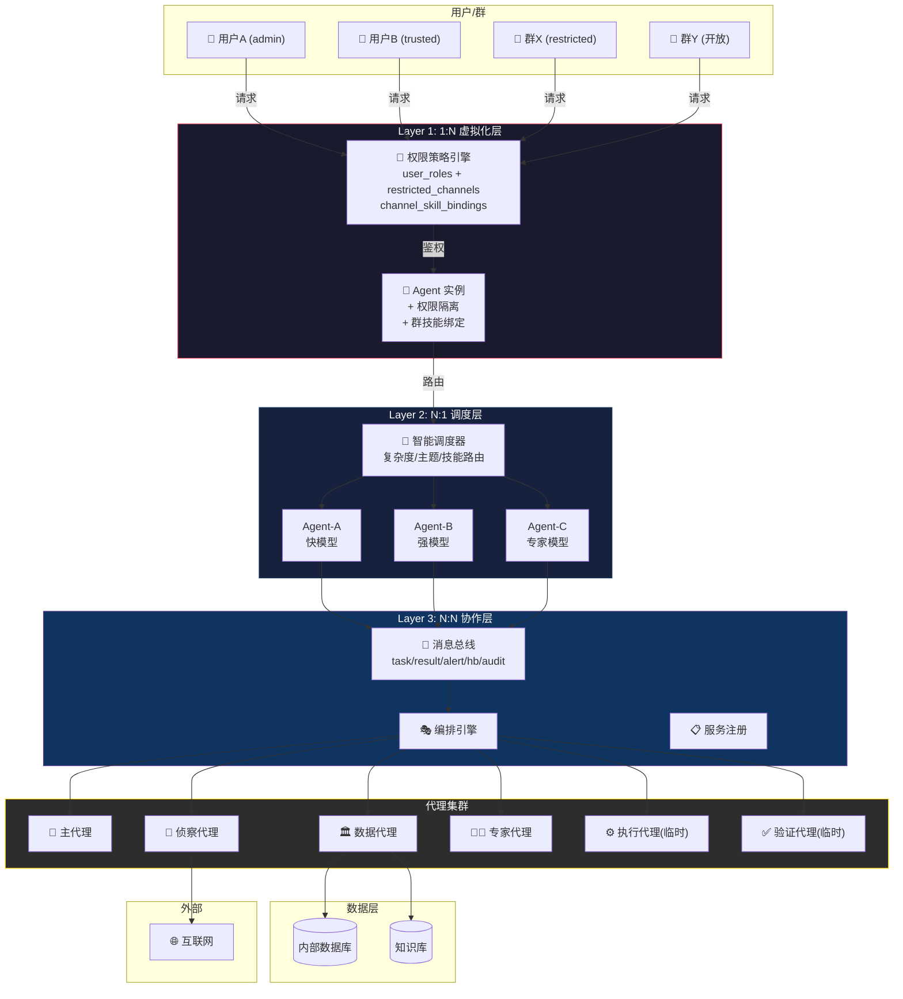

### 6.2 网络分区与数据流向

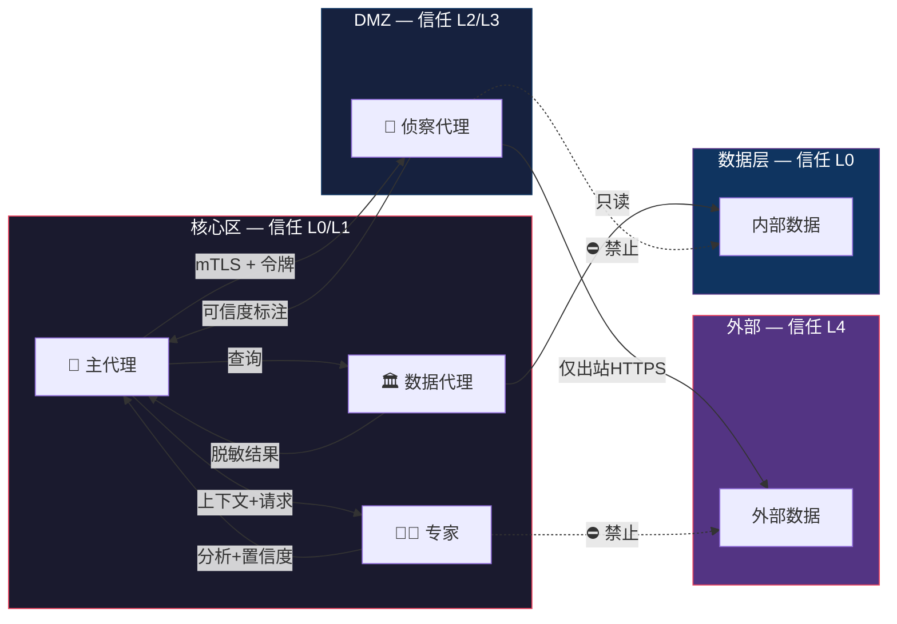

### 6.3 权限体系架构

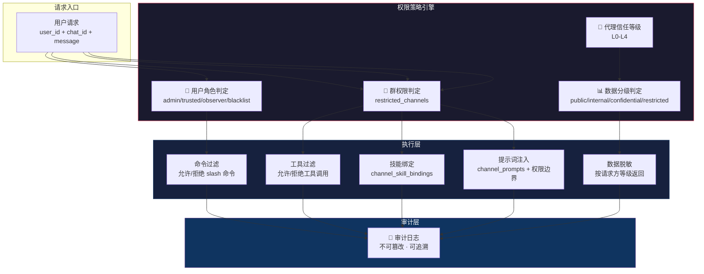

### 6.4 通信通道架构

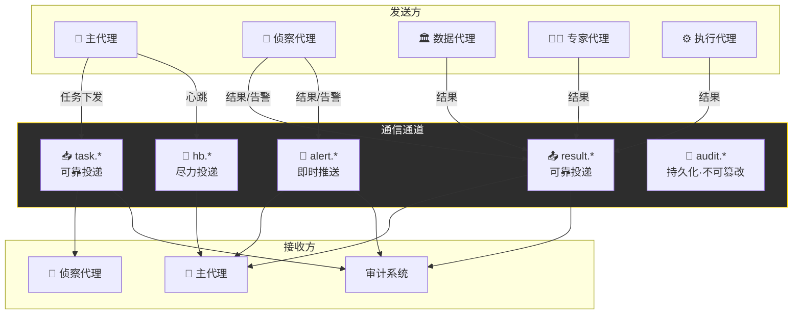

### 6.5 永久代理生命周期

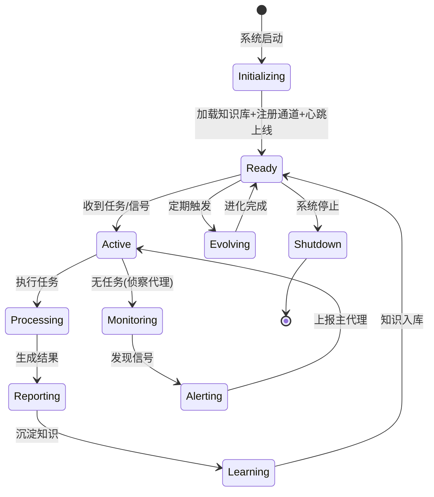

### 6.6 临时代理生命周期

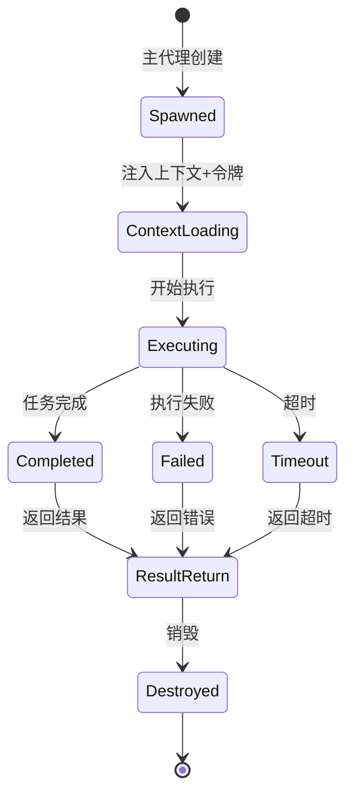

---

## 7. 通信层设计

### 7.1 协议栈

| 层 | 技术选型 | 说明 |
|----|---------|------|
| 传输层 | HTTP/2 + SSE 或 WebSocket | HTTP/2 多路复用；SSE 流式输出；WebSocket 双向实时 |
| 序列化 | JSON-RPC 2.0 | 标准化请求/响应；MessagePack 可选（高性能） |
| 安全 | mTLS 双向认证 + JWT 令牌 | 代理间双向证书验证；令牌控制细粒度权限 |
| 可靠 | 至少一次投递 + 幂等处理 | 消息 ID 去重；死信队列处理异常 |
| 消息中间件 | Redis Stream（轻量）或 NATS（集群） | Redis Stream 单集群；NATS 跨数据中心 |

### 7.2 消息格式

#### 任务下发

```json
{
  "jsonrpc": "2.0",
  "method": "task.execute",
  "id": "task_20260501_001",
  "params": {
    "task_id": "task_20260501_001",
    "target_agent": "scout-01",
    "task_type": "web_research",
    "goal": "搜索 XX 领域最新论文",
    "context": "用户正在进行投研分析...",
    "timeout_seconds": 300,
    "priority": "normal",
    "callback_channel": "result.task_20260501_001",
    "credentials_scope": ["web_search", "web_extract"],
    "created_at": "2026-05-01T10:00:00Z",
    "created_by": "brain"
  }
}
```

#### 告警消息（侦察代理主动推送）

```json
{
  "jsonrpc": "2.0",
  "method": "alert.signal",
  "id": "alert_20260501_001",
  "params": {
    "alert_id": "alert_20260501_001",
    "agent_id": "scout-01",
    "alert_type": "breaking_event",
    "severity": "high",
    "topic": "AI前沿追踪",
    "signal": "DeepSeek 发布新模型",
    "source": "https://...",
    "confidence": 0.72,
    "suggested_action": "交专家代理评估",
    "detected_at": "2026-05-01T09:58:00Z"
  }
}
```

### 7.3 通道 QoS 策略

| 通道 | 投递保证 | 持久化 | 重试 | 超时 |
|------|---------|--------|------|------|
| task.* | 至少一次 | 是 | 3次，指数退避 | 30s确认 |
| result.* | 至少一次 | 是 | 3次 | 按任务设定 |
| alert.* | 尽力投递 | 否 | 0次 | 即时 |
| hb.* | 尽力投递 | 否 | 0次 | 5s |
| audit.* | 恰好一次 | 是，不可篡改 | 无限 | 不超时 |

---

## 8. 协作模式

### 8.1 模式一：咨询型（1:N 虚拟化 + 单 agent）

最常见模式，单 agent 通过权限隔离服务多个用户。

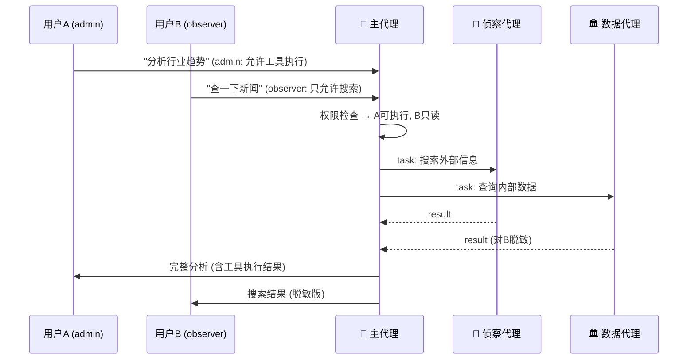

### 8.2 模式二：调度型（N:1 多 agent 服务同一用户）

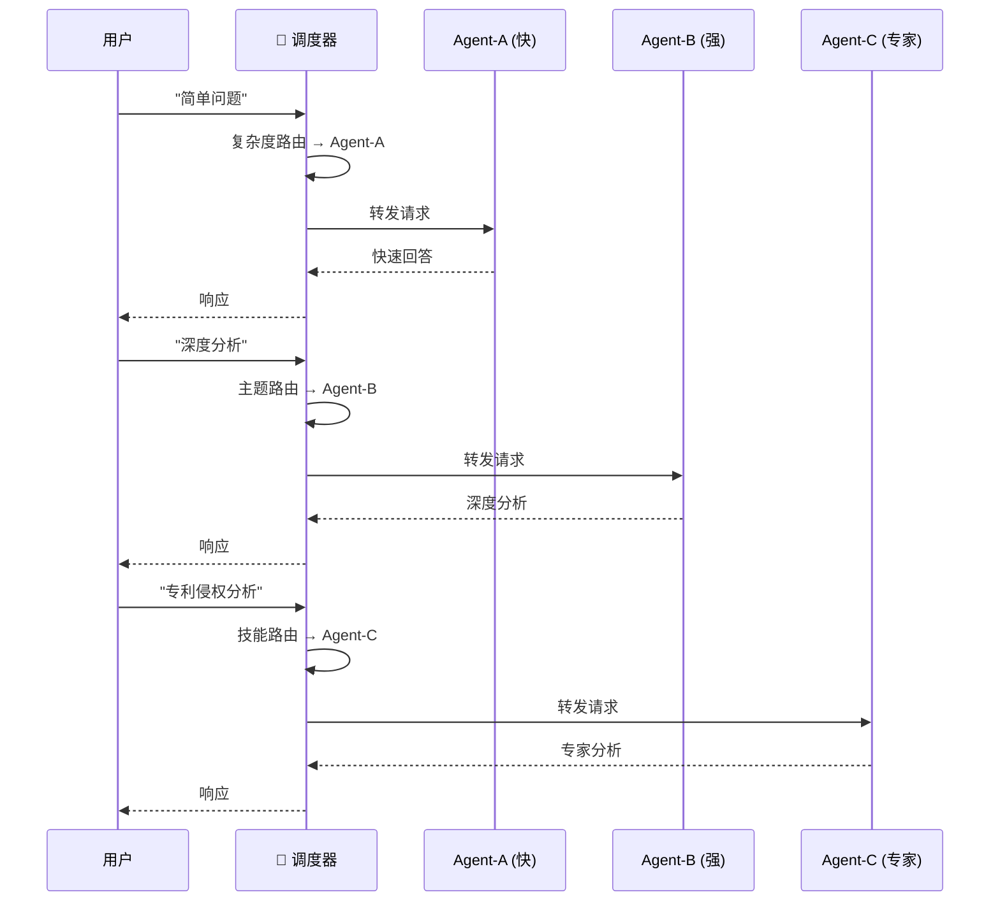

### 8.3 模式三：监控推送型（永久代理主动发现）

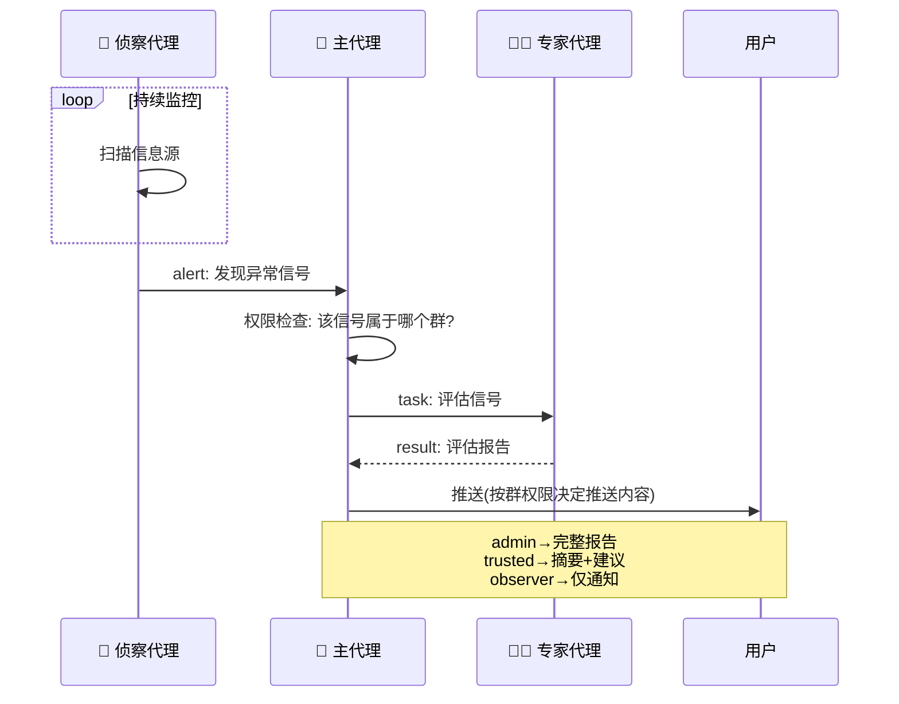

### 8.4 模式四：项目型（临时团队）

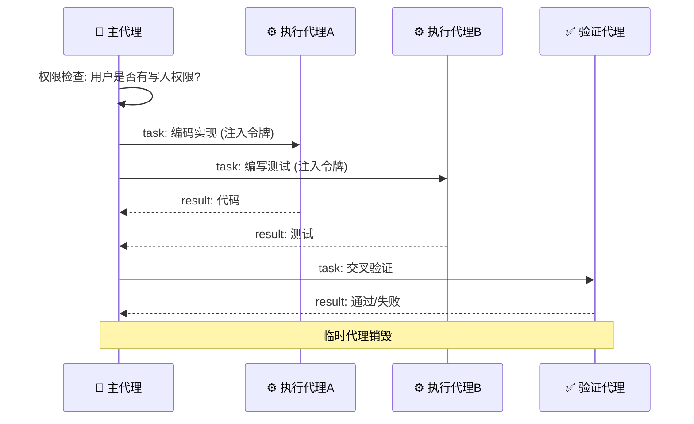

### 8.5 模式五：会诊型（多专家 N:N 协作）

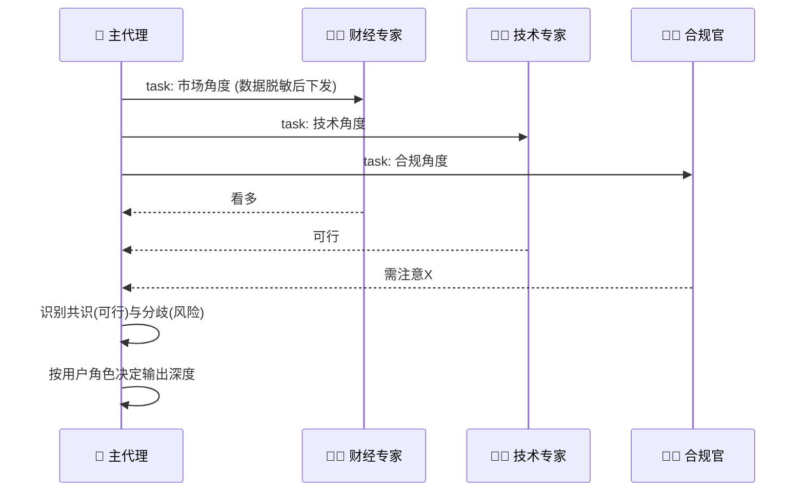

### 8.6 模式六：链式加工型

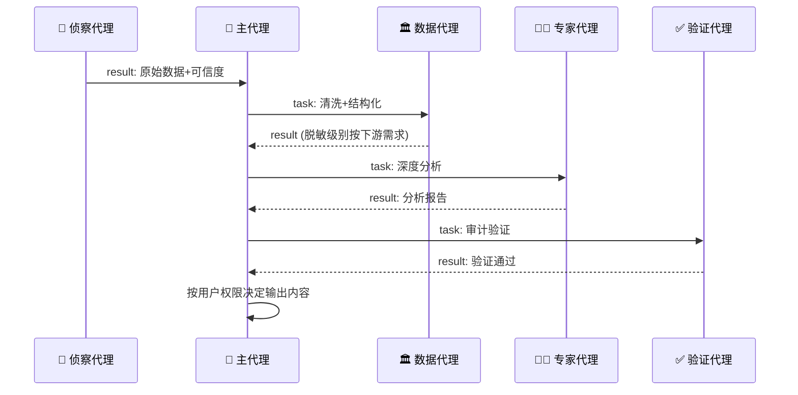

---

## 9. 安全模型

### 9.1 认证与授权

| 机制 | 范围 | 实现 |
|------|------|------|
| mTLS 双向认证 | 代理间通信 | 每个代理持有唯一证书，核心区 CA 签发 |
| JWT 令牌 | 任务级授权 | 主代理签发短期令牌（5分钟），含操作/数据/时间范围 |
| 用户角色 | 用户级 | admin/trusted/observer/blacklist |
| 群权限 | 群级 | restricted_channels + channel_skill_bindings |
| 数据分级 | 数据级 | public/internal/confidential/restricted/pii |

### 9.2 数据保护

| 规则 | 实现 |
|------|------|
| 内部数据只出不进 | 数据代理不向 DMZ 推送原始数据 |
| 外部数据必经清洗 | 侦察代理采集内容必须标注来源和可信度 |
| 跨区通信必经审计 | 所有消息写入审计日志 |
| 脱敏分级 | 按请求方信任等级返回不同粒度数据 |
| 结果大小限制 | 侦察代理单次返回不超过上限 |

### 9.3 审计系统

审计日志仅追加、不可篡改（WORM），保留 365 天。支持按代理、时间、任务ID 检索。异常模式自动检测。

---

## 10. 代理生命周期管理

### 10.1 永久代理自我改进

| 机制 | 触发 | 行动 |
|------|------|------|
| 准确率追踪 | 每次分析被验证后 | 记录对/错，计算准确率趋势 |
| 反馈学习 | 用户采纳/拒绝建议 | 采纳→强化；拒绝→分析原因→调整 |
| 知识淘汰 | 每周 | 审查知识库，标记过时/矛盾条目 |
| 跨域关联 | 发现新知识时 | 检查与其他领域知识的关联 |
| 策略进化 | 准确率持续低于阈值 | 调整分析策略、权重、优先级 |

### 10.2 健康检查与故障恢复

| 检查项 | 频率 | 超时处理 |
|--------|------|---------|
| 心跳 | 30s | 3次缺失→标记不可用→告警 |
| 任务执行 | 按任务超时 | 超时→终止→主代理决定重试或换路 |
| 知识库一致性 | 每小时 | 不一致→从备份恢复→告警 |
| 通信通道 | 每 10s | 断连→指数退避重连→上限后告警 |

---

## 11. 典型企业应用场景

> 每个场景标注：**核心价值**（为什么需要这个架构）、**服务形态**、**协作模式**、**权限要点**

### 11.1 智能投研平台

**核心价值**：专家agent同时服务投研/风控/交易三组人，跨领域关联发现（"你关注的技术股，恰好受这条政策影响"）  
**服务形态**：1:N 虚拟化 + N:N 协作  
**协作模式**：咨询型 + 会诊型

```
研究员(不同权限) → 专家Agent(1:N，见多识广)
  处理投研问题 → 积累行业知识
  处理风控问题 → 积累风险知识
  → 跨领域发现：某行业趋势+某政策变化=系统性风险
  → 主动推送给相关用户

数据流：
  侦察代理(唯一外网出口) → 采集Bloomberg/Reuters/财新
  数据代理(唯一数据入口) → 查询内部持仓+历史研报（脱敏后下发）
  财经专家 → 分析影响+估值+风险
  验证代理 → 交叉检查

权限要点：
  admin → 完整分析+原始数据+操作建议
  trusted → 分析摘要+建议（数据代理返回脱敏版）
  observer → 仅趋势概览（不暴露持仓和估值细节）
```

### 11.2 多群信息分发与专家积累

**核心价值**：一个专家agent服务多个群，每个群看到不同技能/内容，但agent的知识跨群积累（"AI群的论文+财经群的政策=AI监管趋势"）  
**服务形态**：1:N 虚拟化  
**协作模式**：监控推送型

```
单 专家Agent 实例服务多个群：
  AI日报群(restricted) → 绑定AI技能 → 禁止命令/写操作 → 只读+推送
  财经群(restricted)   → 绑定财经技能 → 禁止命令/写操作 → 只读+推送
  管理群(admin only)   → 全部权限 → 可管理技能/配置/数据
  开放群               → 问答+搜索 → 无技能绑定 → 无写操作

专家Agent的跨群洞察：
  AI群讨论"欧盟AI法案" + 财经群讨论"科技股监管风险"
  → 专家Agent发现关联 → 主动在两个群推送："欧盟AI法案将影响你们讨论的这些公司"

侦察代理(永久)发现信号 → 主代理判断属于哪个群
  → 按群权限决定推送内容
  → 按群技能绑定决定用什么视角解读
  → 按用户角色决定推送深度
```

### 11.3 专利监控与侵权预警

**核心价值**：侦察代理是唯一外网出口，数据代理是唯一内部数据入口——所有数据访问归口管理，审计链完整  
**服务形态**：N:N 协作  
**协作模式**：监控推送型 + 链式加工型

```
侦察代理(永久，唯一外网出口) → 持续监控全球专利数据库
  → 发现竞品新专利 → 告警主代理
    → 专利专家：相似度分析+侵权判断
      → 数据代理(唯一数据入口)：比对自有专利库（返回脱敏结果）
        → 验证代理：审计分析逻辑
          → 主代理：按权限输出

权限归口价值：
  侦察代理→外网访问：只有一个出口，所有采集都有审计记录
  数据代理→内部数据：只有一个入口，脱敏策略一致
  如果分散：10个agent各自访问外网=10个审计点=10个可能泄漏的通道
```

### 11.4 安全合规审计

**核心价值**：所有数据访问通过数据代理归口，审计日志不可篡改，合规检查结果可追溯  
**服务形态**：N:N 协作  
**协作模式**：链式加工型

```
主代理 → 定期触发
  数据代理(唯一数据入口) → 提取业务操作日志
  合规官 → 检查政策合规性
  验证代理 → 审计合规官判断（独立于执行链）
  侦察代理(唯一外网出口) → 对照最新监管政策
→ 主代理：合规报告+整改建议
  审计日志归档（不可篡改，WORM存储）
  所有数据访问记录 → 可追溯到具体代理、时间、请求内容
```

### 11.5 技术架构评审

**核心价值**：多专家会诊+数据访问归口——专家不直接访问数据，通过数据代理获取脱敏后上下文  
**服务形态**：N:1 调度 + N:N 协作  
**协作模式**：会诊型

```
调度器 → 识别为"技术"主题 → 路由到技术专家 Agent
  数据代理 → 获取现有架构+性能数据（脱敏后分发给各专家）
  技术专家 → 评估可行性+风险（只看到脱敏数据，不知内部IP/凭证）
  侦察代理 → 调研最佳实践+开源方案（唯一外网出口）
  合规官 → 检查数据安全+隐私
→ 主代理：评审意见+替代方案+风险矩阵

权限归口价值：
  专家不直接访问数据源 → 数据代理控制脱敏粒度
  侦察代理不直连外网 → 代理层控制出口审计
```

### 11.6 知识体系持续构建

**核心价值**：专家agent积累跨领域知识——AI论文+财经政策+专利趋势→跨领域知识图谱  
**服务形态**：1:N 虚拟化 + N:N 协作  
**协作模式**：监控推送 + 链式加工

```
侦察代理(永久) → 持续采集arxiv/GitHub/博客
  → 数据代理 → 清洗+去重+结构化
    → 知识专家(1:N，服务所有知识需求) → 提取知识骨架+关联+演进
      → 跨领域发现：AI论文中的技术→财经群的政策影响→专利群的专利趋势
      → 验证代理 → 交叉验证一致性
        → 主代理 → 知识库更新+变更通知
```

### 11.7 企业知识助手（员工问答）

**核心价值**：一个专家agent服务全公司，从HR到财务到技术的问题都处理，积累跨部门知识  
**服务形态**：1:N 虚拟化  
**协作模式**：咨询型

```
全公司员工 → 专家Agent(1:N)
  HR问："年假政策是什么？" → 积累HR知识
  财务问："报销流程？"       → 积累财务知识
  技术问："VPN怎么连？"      → 积累IT知识
  → 跨部门洞察：
    新员工问"入职需要办什么" → 专家整合HR+IT+财务的回答
    比三个独立agent分别回答更连贯

权限要点：
  每个员工只看到自己有权限的信息
  HR问答中的薪酬数据 → 对非HR脱敏
  财务数据 → 仅财务部门可见完整版
```

### 11.8 智能客服平台

**核心价值**：一个专家agent处理所有客服问题，从售前到售后到技术支持，知识跨场景积累  
**服务形态**：1:N 虚拟化 + N:1 调度  
**协作模式**：咨询型 + 调度型

```
客户 → 调度器 → 专家Agent
  售前咨询 → 积累产品知识+常见顾虑
  技术支持 → 积累故障模式+解决方案
  投诉处理 → 积累客诉模式+根因分析
  → 跨场景洞察：
    技术支持发现某故障高频 → 主动建议售前团队告知客户
    投诉发现某功能引发不满 → 主动建议产品团队优化

权限要点：
  客户 → 只看到自己订单/产品相关信息
  客服 → 看到完整订单+技术细节，但看不到其他客户数据
  管理层 → 看到汇总统计+趋势分析，不暴露单客户信息
```

### 11.9 供应链风控监控

**核心价值**：侦察代理集中管理外网采集（供应商/物流/政策），数据代理集中管理内部采购数据——归口才能完整风控  
**服务形态**：N:N 协作  
**协作模式**：监控推送型 + 链式加工型

```
侦察代理(永久，唯一外网出口) → 持续监控：
  供应商舆情、物流中断信号、原材料价格波动、地缘政治风险

数据代理(唯一数据入口) → 内部数据：
  供应商评估记录、采购合同、库存水位、交付历史

风控专家 → 交叉分析外部信号+内部数据
  → 发现：某供应商舆情恶化 + 该供应商是我司核心材料唯一来源
  → 主动告警：供应链断裂风险，建议启动备选供应商

权限要点：
  采购部门 → 完整供应商信息+替代方案
  生产部门 → 仅影响评估+预计交付延迟
  管理层 → 风险汇总+决策建议
```

### 11.10 个人智能助理

**核心价值**：一个专家agent汇聚个人全部事务和信息——日程、财务、健康、社交、知识——跨领域关联发现，同时安全归口保证个人隐私不泄漏  
**服务形态**：1:N 虚拟化  
**协作模式**：咨询型 + 监控推送型

```
个人用户 → 专家Agent(1:N，一个人全部事务的归口)
  日程管理 → "明天上午有会，下午要交报告"
  财务提醒 → "信用卡本周五还款日，余额够吗？"
  健康跟踪 → "你这周运动了2天，比上周少1天"
  知识归档 → "你上周读的那篇文章，跟今天这个新闻有关联"
  → 跨领域洞察：
    日程+财务："你要出差的那天，正好是账单截止日，提前设置自动还款？"
    健康+日程："你下周会议密集，建议在早间插入运动时间"
    知识+工作："你收藏的那篇论文的方法，正好可以解今天代码的问题"

专家化价值：
  如果日历/财务/健康各一个agent → 彼此不认识，永远无法发现关联
  一个专家agent → 知道你的全部上下文，越用越懂你

安全归口（个人场景安全性是底线）：
  所有个人数据 → 只有一个数据代理持有，其他代理不直接访问
  侦察代理(唯一外网出口) → 出行/天气/新闻等外部信息，审计所有外网请求
  数据代理 → 银行/日历/健康API等个人数据，统一脱敏后注入上下文
  个人凭证（银行token/日历API key）→ 仅数据代理持有，其他代理无法触碰

高稳定执行性：
  日常事务不依赖大模型推理 → 固化技能处理（定时提醒、账单跟踪、日程同步）
  专家Agent处理需要理解的请求 → 与固化技能共享记忆，协同工作
  侦察代理7×24运行 → 监控航班变动、天气预警、关注领域新闻
  故障隔离 → 任何一个代理异常不影响其他代理继续执行

权限要点（最严格，因为是个人隐私）：
  用户本人 → 完整数据+操作权限
  家庭成员(受信任) → 共享日程+共享账单，不暴露私人通讯/健康
  外部服务 → 零数据泄漏，所有API调用经数据代理脱敏
  审计日志 → 用户可查"agent替我做了什么、访问了什么"
```

### 11.11 法律文书智能生成与审查

**核心价值**：专家agent积累合同/判例/法规知识，数据代理管控敏感条款访问  
**服务形态**：1:N 虚拟化  
**协作模式**：项目型 + 链式加工型

```
法务团队 → 专家Agent(1:N)
  合同审查 → 积累合同条款模式+风险点
  诉讼分析 → 积累判例+策略
  合规检查 → 积累法规+违规案例
  → 跨领域洞察：合同条款+最新判例→发现条款风险变化

数据代理(唯一数据入口)：
  内部合同库 → 脱敏后分发给专家（去除商业机密条款）
  客户信息 → 严格脱敏

权限要点：
  合同完整版 → 仅承办法务+审批人可见
  合同摘要 → 团队可见（去除金额/条款细节）
  客户身份 → PII级别，跨代理传输必脱敏
```

### 11.12 跨部门战略决策

**核心价值**：多专家会诊+权限归口——不同部门看到不同深度的同一份分析  
**服务形态**：N:N 协作  
**协作模式**：会诊型

```
CEO提出战略问题 → 主代理
  财经专家：财务影响+ROI（从数据代理获取财务数据，脱敏后分析）
  技术专家：技术可行性+成本
  合规官：法律风险+监管要求
  侦察代理(唯一外网出口)：市场竞品+行业趋势
→ 主代理：识别共识与分歧 → 多视角综合判断

权限要点（同一份分析，不同人看不同深度）：
  CEO → 完整分析+原始数据+所有专家意见
  部门总监 → 本部门相关深度+其他部门摘要
  执行层 → 仅执行所需信息
  董事会 → 战略级摘要+关键决策点
```

### 11.13 PPTX 智能生成

**核心价值**：调度器按主题路由到专业Agent，数据代理控制数据访问范围  
**服务形态**：N:1 调度  
**协作模式**：项目型

```
调度器 → 识别为"创造"主题 → 路由到创作 Agent
  数据代理 → 获取数据+模板（按用户权限脱敏）
  执行代理A → 生成大纲+内容
  执行代理B → 设计图表+排版
  验证代理 → 检查数据准确性+脱敏完整性
→ 主代理：整合+格式转换+投递

权限要点：
  执行代理不直接访问数据 → 通过主代理注入脱敏上下文
  生成的PPT不含PII → 验证代理检查脱敏
  高管版 vs 公开版 → 不同脱敏级别输出
```

### 11.14 智能驾驶舱（个人/团队/项目/能力/执行）

**核心价值**：驾驶舱不是"看板"，是**决策与执行的统一入口**——个人助理兼具个人驾驶舱，企业还需要团队驾驶舱、项目驾驶舱、能力驾驶舱、执行驾驶舱，从PPTX的"输出物"升级为"活的运营中枢"  
**服务形态**：1:N 虚拟化 + N:1 调度 + N:N 协作  
**协作模式**：咨询型 + 监控推送型 + 调度型

```
五种驾驶舱，同一架构，不同视角：

┌─────────────────────────────────────────────────────┐
│  个人驾驶舱（11.10个人助理的延伸）                      │
│  我的日程/任务/知识/健康/财务 → 一屏掌控               │
│  专家Agent理解我的上下文 → 异常主动推送                 │
│  例："你本周3个deadline撞车了，建议调整优先级"          │
└─────────────────────────────────────────────────────┘
┌─────────────────────────────────────────────────────┐
│  团队驾驶舱                                          │
│  团队成员负载/协作瓶颈/知识共享度 → 团队健康度          │
│  专家Agent积累团队模式 → 发现协作问题                   │
│  例："A和B都在等C的接口，C已超载，建议D协助"            │
└─────────────────────────────────────────────────────┘
┌─────────────────────────────────────────────────────┐
│  项目驾驶舱                                          │
│  项目进度/风险/资源/里程碑 → 项目状态全景               │
│  数据代理归口多项目数据 → 跨项目资源冲突发现             │
│  例："项目X占用3个前端，项目Y下周需要2个，资源冲突"      │
└─────────────────────────────────────────────────────┘
┌─────────────────────────────────────────────────────┐
│  能力驾驶舱                                          │
│  技能覆盖率/知识缺口/培训需求 → 组织能力图谱            │
│  专家Agent积累所有项目经验 → 发现能力短板               │
│  例："近3个项目都需要LLM微调，但团队只有1人擅长"         │
└─────────────────────────────────────────────────────┘
┌─────────────────────────────────────────────────────┐
│  执行驾驶舱                                          │
│  任务执行率/阻塞项/SLA达标率 → 执行力仪表盘             │
│  侦察代理监控外部依赖 → 执行风险提前预警                 │
│  例："供应商交付延迟概率70%，建议启动备选方案"           │
└─────────────────────────────────────────────────────┘

数据流（权限归口）：
  数据代理 → 唯一内部数据入口，按驾驶舱角色脱敏
    个人驾驶舱 → 只返回本人数据
    团队驾驶舱 → 返回团队汇总，不暴露个人细节
    项目驾驶舱 → 返回项目数据，跨项目仅管理层可见
  侦察代理 → 唯一外网出口，监控外部风险信号
  验证代理 → 审计驾驶舱数据准确性

权限要点：
  个人 → 看自己的全貌
  团队lead → 看团队汇总+个人负载（不含薪酬等敏感信息）
  PM → 看项目全景+资源占用
  管理层 → 看能力+执行汇总，不暴露项目技术细节
  不同驾驶舱间有数据边界 → 数据代理严格执行
```

### 11.15 智能审批（取代电子流）

**核心价值**：传统电子流是"表单+路由"，智能审批是"理解+判断+执行"——agent理解审批意图、自动核验合规性、关联历史决策、执行审批结果，从流程驱动变为智能驱动  
**服务形态**：1:N 虚拟化 + N:N 协作  
**协作模式**：链式加工型 + 咨询型

```
传统电子流的问题：
  申请人填表 → 固定路由到审批人 → 审批人手动审查 → 通过/驳回
  ❌ 流程僵化：紧急采购走标准流程，3天批不下来
  ❌ 信息割裂：审批人看不到关联信息（预算余额、历史同类审批、合规风险）
  ❌ 人力瓶颈：每个审批人都在做重复的合规检查

智能审批的解法：
  申请人用自然语言描述需求 → 专家Agent理解意图+自动核验
  → 数据代理：查预算余额、历史同类审批、供应商评级、合同条款
  → 合规官：自动检查政策合规性（预算是否超限、供应商是否在黑名单、合同条款是否合规）
  → 验证代理：审计合规判断
  → 主代理：生成审批建议（通过/有条件通过/驳回+理由）
  → 审批人：只需关注例外和建议，不再逐条检查

三级审批机制：
  ┌───────────────────────────────────────────────┐
  │  L1 自动通过（低风险+合规+预算内）              │
  │  例：常规办公用品采购，预算内，供应商白名单       │
  │  agent自动执行，事后通知审批人                   │
  └───────────────────────────────────────────────┘
  ┌───────────────────────────────────────────────┐
  │  L2 建议审批（中风险+需人工确认）               │
  │  例：新供应商首次采购，金额在预算内              │
  │  agent提供审批建议+核验结果，审批人一键确认       │
  └───────────────────────────────────────────────┘
  ┌───────────────────────────────────────────────┐
  │  L3 完整审批（高风险+需深度审查）               │
  │  例：超预算采购、战略级合同、合规存疑             │
  │  agent提供完整分析+多专家意见，审批人深度审查      │
  └───────────────────────────────────────────────┘

专家化价值：
  处理100次采购审批 → 积累采购模式+常见风险+历史决策
  → 越审越准：第101次自动识别"这个供应商上次延迟交付"
  → 越审越快：相似请求自动归类，L1自动通过比例持续提升

权限归口价值：
  所有审批数据 → 数据代理唯一入口，脱敏后分发
  所有外网核验（供应商资质、黑名单查询）→ 侦察代理唯一出口
  所有合规判定 → 合规官代理统一执行，不会出现"这个审批人查了合规，那个忘了查"

高稳定执行性：
  L1自动通过 → 固化技能处理，不依赖大模型推理，毫秒级响应
  L2/L3 → 专家Agent处理，与固化技能共享记忆
  故障隔离 → 合规官异常时自动降级为L3（需人工审查），不自动通过

权限要点：
  申请人 → 只看到自己的申请+审批进度
  审批人 → 看到核验结果+审批建议+关联历史
  合规官 → 看到完整合规检查链路
  管理层 → 审批统计+异常模式（哪些类型频繁L3、哪些审批人积压）
  审计追溯 → 每次审批的全链路记录（谁申请→agent查了什么→合规结果→谁批准）不可篡改
```

### 11.16 研发效能平台

**核心价值**：技术专家agent服务全研发团队，从架构到代码到部署的知识跨项目积累  
**服务形态**：1:N 虚拟化 + N:1 调度  
**协作模式**：咨询型 + 项目型

```
研发团队 → 专家Agent(1:N)
  项目A的架构问题 → 积累架构模式
  项目B的性能问题 → 积累性能优化知识
  项目C的安全漏洞 → 积累安全模式
  → 跨项目洞察：A的架构+B的性能问题=统一优化方案

数据代理(唯一代码仓库入口)：
  读取代码 → 按项目权限脱敏（项目B的代码不暴露给项目A团队）
  读取CI/CD日志 → 按团队权限

权限要点：
  代码访问 → 按项目/仓库粒度控制
  部署权限 → 仅DevOps角色可触发
  安全扫描结果 → 仅安全团队+项目负责人可见
```

---

## 12. 与现有架构的差距与演进路径

### 12.1 差距分析

| 能力 | 现状 | 目标 | 差距 |
|------|------|------|------|
| 用户权限 | ✅ admin/trusted/blacklist + restricted_channels | 完整RBAC + ABAC | 需 observer 角色 + 动态策略 |
| 群权限 | ✅ 三道防线(命令/工具/提示词过滤) | 群级完整权限矩阵 | 需细化工具级权限 |
| 技能绑定 | ✅ channel_skill_bindings (Discord/Slack/Feishu) | 所有平台支持 | 需扩展到 Telegram 等 |
| 代理间通信 | 进程内函数调用 | 跨网络消息总线 | 需新建通信层 |
| 代理调度 | smart_model_routing (仅复杂度) | 多维度路由 | 需主题/技能路由 |
| 代理生命周期 | 临时(delegate_task) | 永久+临时 | 需常驻进程管理 |
| 状态持久化 | 无状态子代理 | 专家有领域知识库 | 需知识库层 |
| 安全分区 | 单机无分区 | 核心区/DMZ隔离 | 需网络架构 |
| 主动推送 | 无 | 侦察代理主动上报 | 需告警通道 |
| 审计追溯 | 无 | 全链路不可篡改审计 | 需审计系统 |
| 数据脱敏 | 无 | 按请求方等级脱敏 | 需脱敏引擎 |
| 权限热加载 | 部分支持(命令/工具实时) | 全量热加载 | 需策略引擎 |

### 12.2 演进路径

#### Phase 1：权限完善 + 单机多进程（MVP）

**目标**：完善现有权限体系 + 验证多代理协作可行性

- 补充 observer 角色
- 工具级权限（denied_tools per channel）
- 主代理 + 侦察代理独立进程
- Redis Stream 单机通信
- Docker Compose 部署

#### Phase 2：网络分区 + 调度层

**目标**：核心区/DMZ 分离 + 多 agent 调度

- 侦察代理部署到 DMZ
- mTLS 双向认证
- 智能调度器（主题/技能路由）
- 数据脱敏引擎

#### Phase 3：专家体系 + N:N 协作

**目标**：永久专家代理 + 消息总线

- 专家代理知识库 + 自我改进
- 消息总线（Redis Stream → NATS）
- 编排引擎
- 服务注册/发现
- 审计系统

#### Phase 4：生产就绪

**目标**：企业级可靠性

- 高可用（健康检查 + 自动重启 + 负载均衡）
- 全链路追踪（OpenTelemetry）
- Kubernetes 部署
- 监控告警（Prometheus + Grafana）

---

## 13. 附录A：消息协议定义

### JSON-RPC 2.0 方法清单

| 方法 | 方向 | 通道 | 说明 |
|------|------|------|------|
| `task.execute` | 主→子 | task.* | 下发任务 |
| `task.cancel` | 主→子 | task.* | 取消任务 |
| `result.submit` | 子→主 | result.* | 提交结果 |
| `result.stream` | 子→主 | result.* | 流式提交 |
| `alert.signal` | 子→主 | alert.* | 主动告警 |
| `alert.ack` | 主→子 | alert.* | 确认告警 |
| `hb.ping` | 子→主 | hb.* | 心跳 |
| `hb.pong` | 主→子 | hb.* | 心跳确认 |
| `audit.log` | 所有→审计 | audit.* | 审计日志 |
| `config.update` | 主→子 | task.* | 配置热更新 |
| `knowledge.sync` | 专家↔知识库 | task.* | 知识同步 |
| `permission.check` | 子→主 | task.* | 权限校验请求 |
| `permission.grant` | 主→子 | result.* | 临时授权 |

### 错误码

| 码 | 含义 |
|----|------|
| -32700 | JSON 解析错误 |
| -32600 | 无效请求 |
| -32601 | 方法不存在 |
| -32602 | 参数无效 |
| -32603 | 内部错误 |
| -32001 | 代理不可用 |
| -32002 | 任务超时 |
| -32003 | 权限不足 |
| -32004 | 数据脱敏失败 |
| -32005 | 知识库不一致 |
| -32006 | 令牌过期 |
| -32007 | 证书无效 |
| -32008 | 群权限拒绝 |
| -32009 | 用户角色不足 |
| -32010 | 数据分级冲突 |

---

## 14. 附录B：权限策略配置参考

### 完整群权限配置

```yaml
gateway:
  user_roles:
    admin:
      - ou_d366ba075912a3865430a7fe7020454b
    trusted:
      - ou_trusted_user_1
      - ou_trusted_user_2

  restricted_channels:
    oc_6ed1cc645057da3bbe93c6120219a61e:  # AI日报群
      users:
        - id: ou_d366ba075912a3865430a7fe7020454b
          role: admin
        - id: ou_trusted_user_1
          role: trusted
      allowed_commands: []          # 禁止所有命令
      allowed_toolsets:             # 允许的工具集
        - web
        - file
      denied_tools:                 # 禁止的工具
        - terminal
        - write_file
        - skill_manage
        - memory
      max_iterations_per_user: 30   # 用户级迭代预算
      blacklist:
        - ou_blacklisted_user

feishu:
  channel_skill_bindings:
    - id: "oc_6ed1cc645057da3bbe93c6120219a61e"
      skills: ["group-thinking", "source-evolution", "core-thinking"]
  channel_prompts:
    "oc_6ed1cc645057da3bbe93c6120219a61e": |
      你是AI日报群的助手。
      ✅ 允许：回答问题、搜索信息、推送日报
      ❌ 禁止：修改技能、执行命令、有副作用的操作
```

### 代理信任等级配置

```yaml
agents:
  brain:
    trust_level: L0
    network_zone: core
    allowed_outbound: [vault, expert, scout, worker, auditor]
  
  scout:
    trust_level: L3
    network_zone: dmz
    allowed_outbound: [brain]  # 只能回传主代理
    allowed_external: true     # 允许外网访问
    max_result_size_kb: 512
  
  vault:
    trust_level: L1
    network_zone: core
    allowed_outbound: [brain]  # 只能返回主代理
    data_access: read_only
    desensitization: true      # 返回结果需脱敏
  
  expert:
    trust_level: L2
    network_zone: core
    allowed_outbound: [brain]  # 只能返回主代理
    direct_data_access: false  # 不直接访问数据
    direct_external: false     # 不直接访问外网
```
