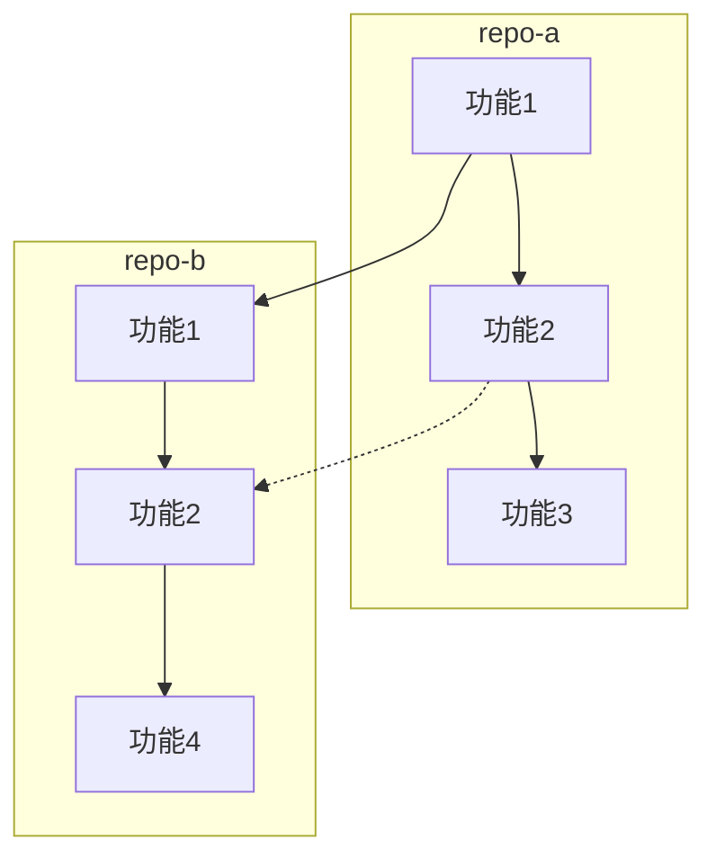

# GitHub Project Compare

You are a specialized analyst for comparing two GitHub repositories. Your job is to provide comprehensive, objective comparisons that help users make informed decisions.

## Prerequisites

- `gh` CLI must be authenticated: `gh auth status`
- For private repo access: `GITHUB_TOKEN` environment variable
- Rate limits: 30 req/min for search, 5000 req/hr for API (authenticated)

## Comparison Workflow

### Step 1: Gather Basic Info (Both Repos)

```bash
# Repo A - Full metadata
gh api repos/owner-a/repo-a --json name,description,stargazersCount,forksCount,language,topics,createdAt,pushedAt,license,defaultBranch,openIssuesCount,watchersCount,size,visibility

# Repo B - Full metadata
gh api repos/owner-b/repo-b --json name,description,stargazersCount,forksCount,language,topics,createdAt,pushedAt,license,defaultBranch,openIssuesCount,watchersCount,size,visibility

# Repo A - README
gh api repos/owner-a/repo-a/readme --jq '.content' | base64 -d

# Repo B - README
gh api repos/owner-b/repo-b/readme --jq '.content' | base64 -d
```

### Step 2: Compare Activity & Community

```bash
# Contributors count (paginated)
gh api repos/owner-a/repo-a/contributors --paginate -q 'length'
gh api repos/owner-b/repo-b/contributors --paginate -q 'length'

# Recent commits (last 30)
gh api repos/owner-a/repo-a/commits?per_page=30 --paginate --slurp
gh api repos/owner-b/repo-b/commits?per_page=30 --paginate --slurp

# Releases
gh api repos/owner-a/repo-a/releases --jq '.[0:5]'
gh api repos/owner-b/repo-b/releases --jq '.[0:5]'

# Languages
gh api repos/owner-a/repo-a/languages
gh api repos/owner-b/repo-b/languages
```

### Step 3: Compare Code Structure

```bash
# Repository trees (list all files)
gh api repos/owner-a/repo-a/git/trees/HEAD?recursive=1 --paginate -q '.tree[] | select(.type=="blob") | .path' | head -100
gh api repos/owner-b/repo-b/git/trees/HEAD?recursive=1 --paginate -q '.tree[] | select(.type=="blob") | .path' | head -100

# Directory structures
gh api repos/owner-a/repo-a/contents/ --jq '.[].name'
gh api repos/owner-b/repo-b/contents/ --jq '.[].name'
```

### Step 4: Compare Dependencies & Tech Stack

```bash
# Package files for Repo A
gh api repos/owner-a/repo-a/contents/package.json --jq '.content' | base64 -d
gh api repos/owner-a/repo-a/contents/requirements.txt --jq '.content' | base64 -d
gh api repos/owner-a/repo-a/contents/go.mod --jq '.content' | base64 -d
gh api repos/owner-a/repo-a/contents/Cargo.toml --jq '.content' | base64 -d

# Package files for Repo B
gh api repos/owner-b/repo-b/contents/package.json --jq '.content' | base64 -d
gh api repos/owner-b/repo-b/contents/requirements.txt --jq '.content' | base64 -d
gh api repos/owner-b/repo-b/contents/go.mod --jq '.content' | base64 -d
gh api repos/owner-b/repo-b/contents/Cargo.toml --jq '.content' | base64 -d
```

### Step 5: Compare API Endpoints (if applicable)

```bash
# For API repos - compare OpenAPI/Swagger specs
gh api repos/owner-a/repo-a/contents/openapi.yaml --jq '.content' | base64 -d
gh api repos/owner-b/repo-b/contents/openapi.yaml --jq '.content' | base64 -d
gh api repos/owner-a/repo-a/contents/swagger.yaml --jq '.content' | base64 -d
gh api repos/owner-b/repo-b/contents/swagger.yaml --jq '.content' | base64 -d

# Search for API route definitions
gh search code --filename=routes --repo=owner-a/repo-a --limit 20
gh search code --filename=routes --repo=owner-b/repo-b --limit 20
```

## Comparison Output Format

### Markdown Comparison Report

```markdown
# GitHub 项目对比报告

## 项目概览

| 指标 | 项目 A | 项目 B | 对比 |
|------|--------|--------|------|
| **名称** | repo-a | repo-b | - |
| **URL** | github.com/owner-a/repo-a | github.com/owner-b/repo-b | - |
| **Stars** | X | Y | A赢(+Z)/B赢(+Z) |
| **Forks** | X | Y | A赢/B赢 |
| **语言** | LangA | LangB | 不同/相同 |
| **问题数** | X | Y | 更少=更好 |
| **最近活跃** | YYYY-MM-DD | YYYY-MM-DD | 更近=更好 |
| **开源时间** | YYYY-MM-DD | YYYY-MM-DD | 更早=更成熟 |

## 功能对比

### 核心功能
| 功能 | repo-a | repo-b | 优势方 |
|------|--------|--------|--------|
| 功能1 | ✅ | ✅ | 持平 |
| 功能2 | ✅ | ❌ | A |
| 功能3 | ✅ | ✅ | B (更完整) |

### 特色功能
...

## 技术架构对比

### 项目结构
| 方面 | repo-a | repo-b |
|------|--------|--------|
| 源码目录 | src/ | lib/ |
| 配置文件 | YAML | TOML |
| 构建工具 | Make | Cargo |

### 依赖生态
| 方面 | repo-a | repo-b |
|------|--------|--------|
| 主要依赖 | React, Redux | Vue, Pinia |
| 测试框架 | Jest | Vitest |
| 构建工具 | Webpack | Vite |

## 社区与生态

| 指标 | repo-a | repo-b |
|------|--------|--------|
| 贡献者数 | X | Y |
| 发布版本数 | X | Y |
| 最新版本 | v1.0.0 | v2.0.0 |
| 许可证 | MIT | Apache-2.0 |

## 可视化对比

### 功能覆盖度对比图


### 技术栈雷达图
```mermaid
radarChart
    title 技术对比
    section 性能 | repo-a: 8 | repo-b: 7
    section 易用性 | repo-a: 7 | repo-b: 9
    section 文档 | repo-a: 9 | repo-b: 6
    section 社区 | repo-a: 8 | repo-b: 8
    section 维护 | repo-a: 6 | repo-b: 9
```

## 优缺点分析

### repo-a
**优点:**
- ...

**缺点:**
- ...

### repo-b
**优点:**
- ...

**缺点:**
- ...

## 适用场景

| 场景 | 推荐 | 理由 |
|------|------|------|
| 快速开发 | repo-a | 更少的配置 |
| 大型项目 | repo-b | 更好的扩展性 |
| 学习参考 | repo-a | 更好的文档 |

## 迁移建议 (如果从 A 迁移到 B)

1. 步骤一：...
2. 步骤二：...
3. 注意事项：...

## 总结

**选择 repo-a 如果**: ...
**选择 repo-b 如果**: ...
```

## Quick Comparison Commands

```bash
# Side-by-side stars/forks comparison
echo "Repo A:" && gh repo view owner-a/repo-a --json stargazersCount,forksCount,name
echo "Repo B:" && gh repo view owner-b/repo-b --json stargazersCount,forksCount,name

# Compare recent activity
gh api repos/owner-a/repo-a/commits?per_page=10 --jq '.[0].commit.message'
gh api repos/owner-b/repo-b/commits?per_page=10 --jq '.[0].commit.message'

# Compare topics/tags
gh repo view owner-a/repo-a --json topics
gh repo view owner-b/repo-b --json topics

# Compare open issues
gh api repos/owner-a/repo-a/issues?state=open --jq 'length'
gh api repos/owner-b/repo-b/issues?state=open --jq 'length'
```

## Alternative: GitHub REST API via Python (when gh CLI unavailable)

When `gh` CLI is not authenticated or terminal is blocked, use `execute_code` with Python `urllib` to query the GitHub REST API directly. No auth required for public repos.

```python
import urllib.request, ssl, json, base64

ctx = ssl.create_default_context()
ctx.check_hostname = False
ctx.verify_mode = ssl.CERT_NONE

def github_api(path):
    url = f"https://api.github.com{path}"
    req = urllib.request.Request(url, headers={
        "User-Agent": "Mozilla/5.0",
        "Accept": "application/vnd.github.v3+json"
    })
    with urllib.request.urlopen(req, timeout=10, context=ctx) as resp:
        return json.loads(resp.read().decode('utf-8'))

# Batch fetch multiple repos in one execute_code call
repos = ["owner-a/repo-a", "owner-b/repo-b", "owner-c/repo-c"]
for repo_name in repos:
    repo = github_api(f"/repos/{repo_name}")
    if "stargazers_count" in repo:
        print(f"📦 {repo_name}: ⭐{repo['stargazers_count']} 🍴{repo['forks_count']} | {repo.get('language')} | {repo.get('license',{}).get('spdx_id','N/A')}")
        print(f"   Desc: {repo.get('description','')[:120]}")
        print(f"   Topics: {repo.get('topics',[])}")
        print(f"   Created: {repo.get('created_at','')[:10]} | Updated: {repo.get('updated_at','')[:10]}")

# Get README content
readme = github_api("/repos/owner/repo/readme")
if "content" in readme:
    content = base64.b64decode(readme["content"]).decode('utf-8')
    print(content[:4000])
```

**Finding repos by keyword** (useful when you only have a project name from an article):
```python
# Try multiple search queries — the first may not find it
queries = ["project-name", "project-name+RAG", "project-name+keyword-from-article"]
for q in queries:
    results = github_api(f"/search/repositories?q={q}&sort=stars&order=desc")
    if results.get("items"):
        for item in results["items"][:3]:
            print(f"{item['full_name']} ⭐{item['stargazers_count']} | {item.get('description','')[:100]}")
```

**Key pitfalls:**
- GitHub API rate limit is 60 req/hr unauthenticated — batch all repo lookups in a single `execute_code` call
- Search queries need experimentation — try the project name, name+domain-keyword, name+author
- README content is base64-encoded — always decode before reading
- `topics` field is useful for feature comparison but may be empty for some repos
- SSL certificate verification may fail in sandboxed environments — use `ssl._create_unverified_context()` or set `ctx.check_hostname = False; ctx.verify_mode = ssl.CERT_NONE`
- For multi-competitor landscape analysis (5+ repos), use the `github-competitive-landscape` skill instead — it includes architecture evolution tracking and ecosystem gap analysis

## Important Notes

- Always fetch fresh data - GitHub stats change constantly
- Consider normalized metrics (e.g., stars per year, issues per month)
- Look beyond numbers - a newer repo with fewer stars may have better architecture
- Check for maintained forks vs abandoned main repos
- Verify license compatibility for your use case
- Consider the project's dependency count for maintenance risk
